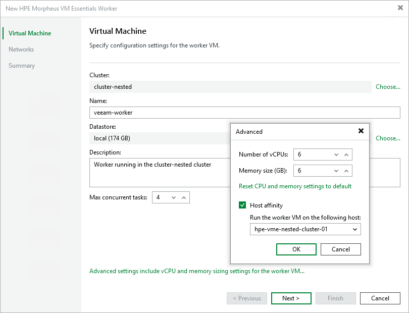

# Step 2. Specify Worker VM Settings

At the Virtual Machine step of the wizard, do the following:

1. Click Choose next to the Cluster field to specify a cluster where the worker will be launched.
2. In the Name field, specify a name for the worker. The maximum length of the name is 63 characters; the following characters are only supported: a-z, A-Z, 0-9, -.
3. Click Choose next to the Datastore field to select a datastore where the root volume of the worker will be stored. For a datastore to be displayed in the list of available storage, it must be configured in the virtual environment as described in [HPE Morpheus VM Essentials documentation](https://support.hpe.com/hpesc/public/docDisplay?docId=sd00007322en_us&page=GUID-D3548220-4D77-4DBB-8313-CFAD68416264.html).
4. In the Description field, provide a description for future reference. The maximum length of the description is 1024 characters.
5. In the Max concurrent tasks field, specify the number of tasks that the worker will be able to handle in parallel. If this value is exceeded, the worker will not start processing a new task until one of the currently running tasks finishes.

By default, workers process up to 4 concurrent tasks; however, you can change this number in the range between 2 to 18 — in this case, the wizard automatically adjusts the amount of resources that will be allocated to the worker. If you want to specify the amount of resources manually, click Advanced settings.

|  |
| --- |
| Note |
| When performing data protection and disaster recovery operations, Veeam Backup & Replication initiates a new task for each VM that is being processed. |

1. To specify a host where the worker will be launched, click Advanced settings, select the Host affinity check box and choose the host.

If you do not specify host affinity settings, Veeam Backup & Replication will automatically define the host to launch the worker.

|  |
| --- |
| Note |
| Ensure that you do not specify hosts in the disabled state, offline state or switched to the maintenance mode since they are still displayed in the list of available hosts. |

