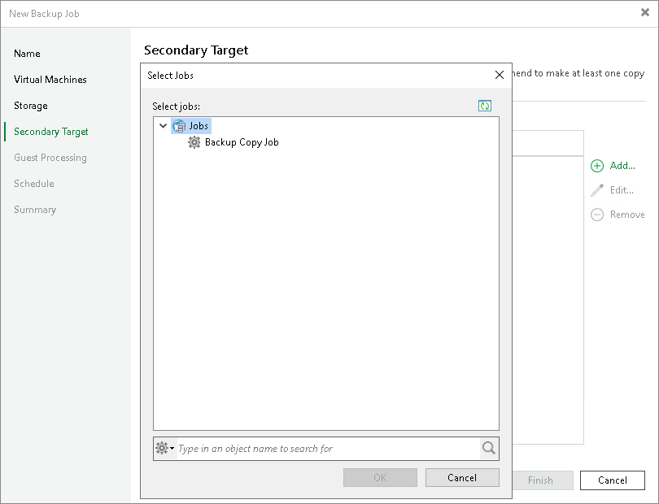

# Step 9. Specify Secondary Target

In this article

The Secondary Target step of the wizard is available if you have enabled the Configure secondary destinations for this job option at the Storage step of the wizard.

At the Secondary Target step of the wizard, you can link the backup job to a backup to tape or backup copy job. As a result, the backup job will be used as a source for the backup to tape or backup copy job. Backup files created by the backup job will be archived to tape or copied to the secondary backup repository according to the secondary job schedule. For more information, see [Linking Backup Jobs to Backup Copy Jobs](linking_backup_to_copy.md) and [Linking Backup Jobs to Backup to Tape Jobs](linking_backup_to_backup_to_tape.md).

The backup to tape job or backup copy job must be configured beforehand. You can create these jobs with an empty source. When you link the backup job to these jobs, Veeam Backup & Replication will automatically update the linked jobs to define the backup job as a source for these jobs.

To link jobs:

1. Click Add.
2. From the jobs list, select a backup to tape or backup copy job that must be linked to the backup job. You can link several jobs to the backup job, for example, one backup to tape job and one backup copy job. To quickly find the job, use the search field at the bottom of the wizard.

Page updated 8/28/2025

Page content applies to build 13.0.1.1071
