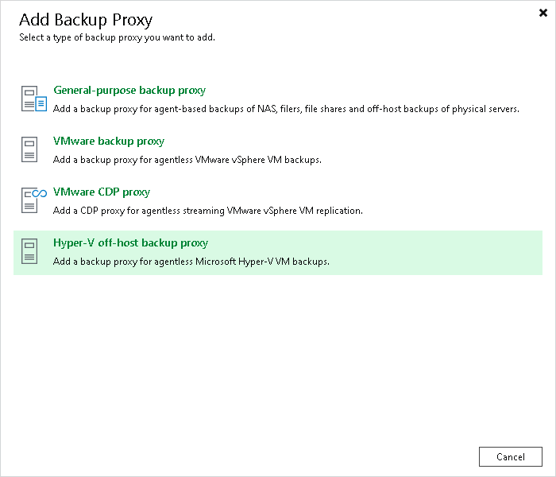

# Step 1. Launch New Hyper-V Off-Host Backup Proxy Wizard

In this article

To launch the New Hyper-V Off-Host Backup Proxy wizard, do the following:

1. Open the Backup Infrastructure view.
2. In the [inventory pane](vbr_ui.md), right-click the Backup Proxies node and select Add Proxy. Alternatively, you can click Add Proxy on the ribbon.
3. In the Add Backup Proxy window, select Hyper-V off-host backup proxy.

Page updated 12/21/2023

Page content applies to build 13.0.1.1071
