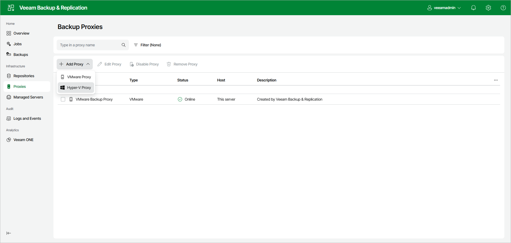

# Step 1. Launch the New Hyper‑V Off-Host Backup Proxy Wizard

In this article

To launch the New Hyper-V Proxy wizard, do the following:

1. Open the Proxies node in the management pane.
2. Click Add Proxy on the ribbon and select Hyper-V Proxy.

Page updated 8/13/2025

Page content applies to build 13.0.1.1071
