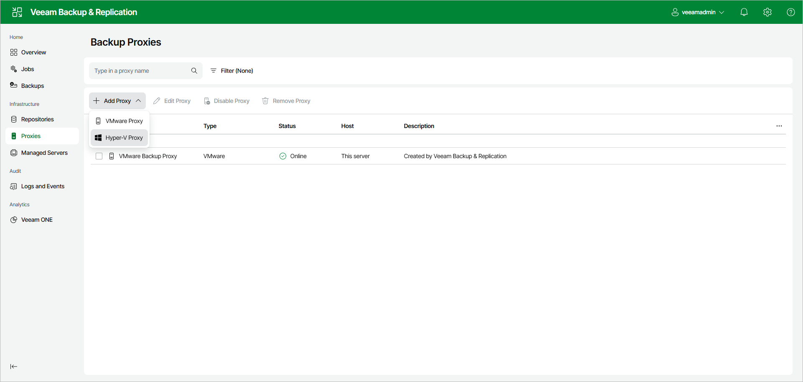

# Step 1. Launch the New Hyper‑V Off-Host Backup Proxy Wizard

To launch the New Hyper-V Proxy wizard, do the following:

1. Open the Proxies & Workers node in the management pane.
2. Click Add Proxy on the ribbon and select Hyper-V Proxy.

Page updated 2026-06-29

