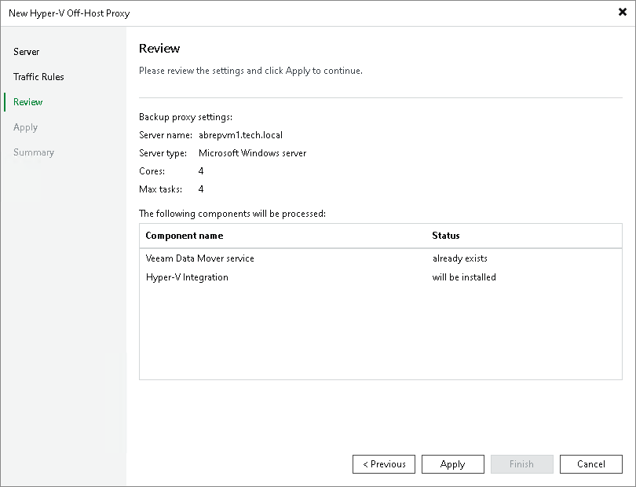

# Step 4. Review Components

In this article

At the Review step of the wizard, review what Veeam Backup & Replication components are already installed on the off-host backup proxy and what components will be installed.

1. Review the components.
2. Click Apply to add the off-host backup proxy.

Page updated 9/5/2025

Page content applies to build 13.0.1.1071
