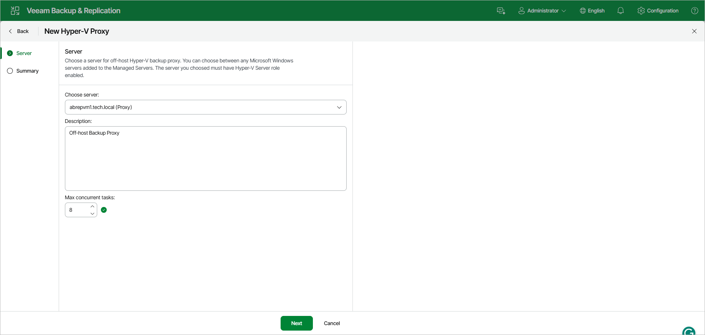

# Step 2. Choose Server

At the Server step of the wizard, specify server settings for the off-host backup proxy.

1. From the Choose server list, select a Microsoft Windows server to which you want to assign the off-host backup proxy role.

The list contains only servers added to the backup infrastructure. For more information, see [Adding Microsoft Windows Servers](add_windows_server.md).

1. In the Description field, provide a description for future reference. The default description contains information about the user who added the off-host backup proxy, date and time when the off-host backup proxy was added.
2. In the Max concurrent tasks field, specify the number of tasks that the off-host backup proxy must handle in parallel. If this value is exceeded, the off-host backup proxy will not start a new task until one of current tasks is finishes.

Veeam Backup & Replication creates one task per every VM disk. The recommended number of concurrent tasks is calculated automatically based on available resources. Off-host backup proxies with multi-core CPUs can handle more concurrent tasks. For example, for a 4-core CPU, it is recommended to specify maximum 8 concurrent tasks, for an 8-core CPU — 16 concurrent tasks. When defining the number of concurrent tasks, consider network traffic throughput in the virtual infrastructure.

