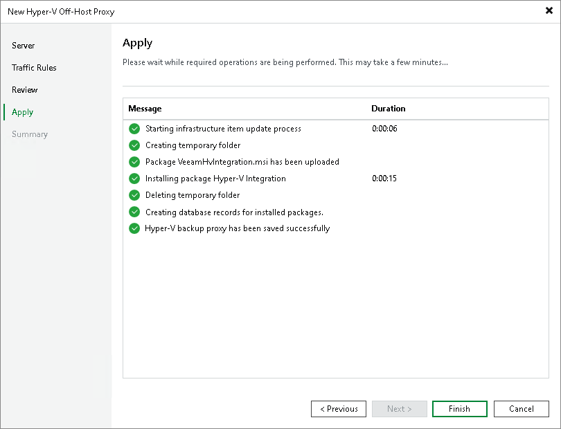

# Step 5. Finish Working with Wizard

In this article

At the Apply step of the wizard, complete the procedure of off-host backup proxy configuration.

1. Review details of the off-host backup proxy.
2. Click Next, then click Finish to exit the wizard.

Page updated 1/25/2024

Page content applies to build 13.0.1.1071
