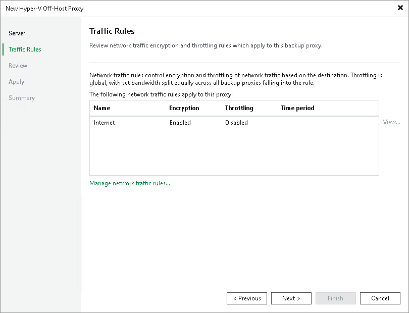

# Step 3. Configure Traffic Rules

At the Traffic Rules step of the wizard, configure network traffic rules. These rules help you throttle and encrypt traffic transferred between backup infrastructure components. For more information, see [Configuring Network Traffic Rules](network_rules.md).

The list of network traffic rules contains only the rules that are applicable to the off-host backup proxy. The rule is applied to the off-host backup proxy if the IP address of the off-host backup proxy falls into an IP range of the rule.

To view rule settings:

1. Select the rule in the list.
2. Click View on the right of the rule list.

You can open global network traffic settings and modify them directly from the New Hyper-V Off-Host Proxy wizard. To do this, click the Manage network traffic rules link at the bottom of the wizard.

