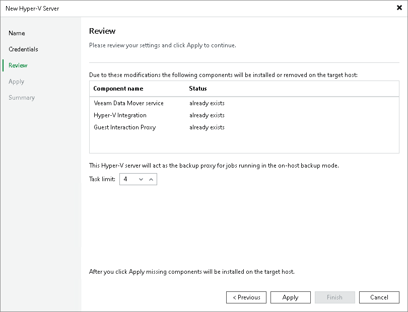

# Step 5. Review Components

This step is available only if you selected to add a standalone Microsoft Hyper-V server.

At the Review step of the wizard, review what Veeam Backup & Replication components are already installed on the server and what components will be installed.

In the Task limit field specify the number of tasks that the Microsoft Hyper-V host must handle in parallel. If this value is exceeded, Veeam Backup & Replication will not start a new task against the Microsoft Hyper-V host until one of current tasks is finished.

Veeam Backup & Replication creates one task per every VM disk. By default, the Task limit value is set to 4.

Limiting the number of concurrent tasks may be necessary if you plan to work in the on-host backup mode (where the Microsoft Hyper-V host performs the role of the default backup proxy) and want to balance the workload in the backup infrastructure.

The Task limit field is displayed only for standalone Microsoft Hyper-V hosts. To limit the number of concurrent tasks for hosts managed by SCVMM or Microsoft Hyper-V cluster, you need to set this value in settings of each Microsoft Hyper-V host in the SCVMM hierarchy or cluster separately. To do this, open the Backup Infrastructure view, in the inventory pane select the added SCVMM or Microsoft Hyper-V cluster, in the working area right-click the Microsoft Hyper-V host and select Properties.

