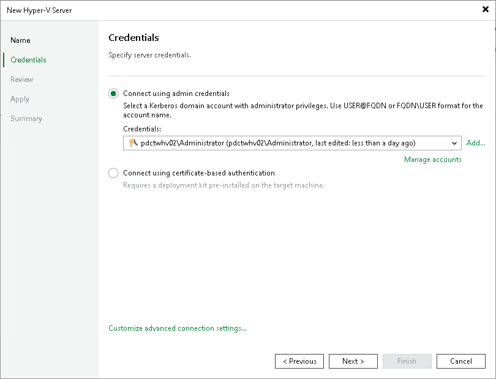
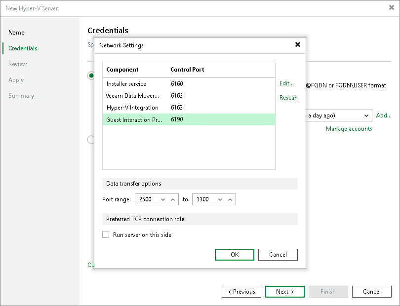

# Step 3. Specify Credentials

In this article

At the Credentials step of the wizard, specify credentials for the Microsoft Hyper-V server.

1. Select one of the following options:

* Connect using admin credentials — this method uses the standard Windows Kerberos authentication protocol. It is recommended for environments with Active Directory or where traditional authentication is required. For more information, see [Kerberos Authentication](kerberos_authentication.md).

From the Credentials list, select credentials for the account that has administrator privileges on the Microsoft Hyper-V server. If you have not set up credentials beforehand, click the Manage accounts link or click Add on the right to add the credentials. For more information, see [Managing Credentials](credentials_manager.md).

Veeam Backup & Replication will use the provided credentials to deploy the following components on every added server:

* Veeam Installer Service
* Veeam Data Mover/Veeam Transport Service
* Veeam Hyper-V Integration Service
* Guest Interaction Proxy Service

If you are adding SCVMM, the same credentials will be applied to all Microsoft Hyper-V hosts managed by SCVMM. If some Microsoft Hyper-V hosts use their own credentials different from those you have provided, Veeam Backup & Replication will fail to deploy components on these hosts. You will have to specify credentials for such Microsoft Hyper-V hosts separately.

After you connect SCVMM, expand it in the inventory pane to see the list of managed Microsoft Hyper-V hosts. Right-click the host, select Properties and use the Edit Hyper-V Server wizard to specify the credentials for this host.

* [For a standalone Microsoft Hyper-V host] Connect using certificate-based authentication — select this option if you have pre-installed the Veeam Deployment Kit on the target server. With this method, no user name or password is required; authentication is performed using certificates. It is recommended for environments where Kerberos is disabled or unavailable, or for enhanced security. For more information, see [Using Veeam Deployment Kit](deployment_kit.md).

1. To customize network ports used by Veeam Backup & Replication components, click Customize advanced connection settings. By default, Veeam Backup & Replication components use the following ports:

+ Veeam Installer Service: port 6160
+ Veeam Data Mover Service/Veeam Transport Service: port 6162
+ Veeam Hyper-V Integration: port 6163
+ Guest Interaction Proxy: port 6190

If necessary, adjust port numbers.

1. In the Data transfer options section of the Network Settings window, specify connection settings for file copy operations. Provide a range of ports that will be used as transmission channels between the source host and target host (one port per task). By default, Veeam Backup & Replication uses port range 2500-3300. If the virtual environment is not large and data traffic will not be significant, you can specify a smaller range of ports, for example, 2500-2509 to run 10 concurrent jobs at the same time.
2. [For Microsoft Hyper-V host deployed outside NAT] In the Preferred TCP connection role section select the Run server on this side check box. In the NAT scenario, the outside client cannot initiate a connection to the server on the NAT network. As a result, services that require initiation of the connection from outside can be disrupted. With this option selected, you will be able to overcome this limitation and initiate a "server-client" connection — that is, a connection in the direction of the Microsoft Hyper-V host.

The option applies if the Hyper-V host also performs the role of the onhost backup proxy.

Page updated 10/16/2025

Page content applies to build 13.0.1.1071
