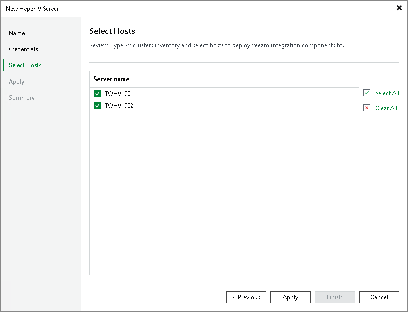

# Step 4. Select Hosts

This step is available only if you selected to add an SCVMM server or a Microsoft Hyper-V cluster.

At the Select Hosts step of the wizard, you can select hosts to deploy Veeam integration components to.

Veeam Backup & Replication will check every managed Microsoft Hyper-V host to install or update the components. If you do not plan to use some Microsoft Hyper-V hosts for data protection operations, you can clear check boxes next to these hosts in the list. Veeam Backup & Replication will not deploy or update its components on excluded hosts, although such hosts will be available in the SCVMM hierarchy.

If necessary, you can instruct Veeam Backup & Replication to install components on hosts that were initially excluded later. To do this, open the Backup Infrastructure view, in the inventory pane select the added SCVMM or Microsoft Hyper-V cluster. In the working area right-click the Microsoft Hyper-V host and select Properties.

