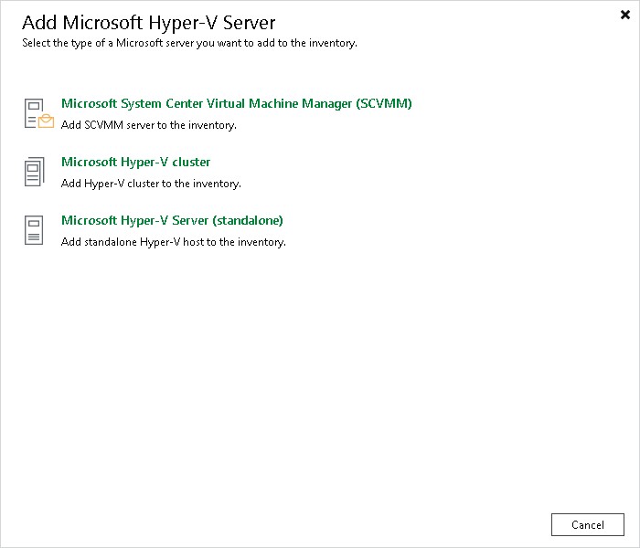

# Step 1. Launch New Hyper-V Server Wizard

In this article

To launch the New Hyper-V Server wizard, do one of the following:

* Open the Inventory or Files view. In the [inventory pane](vbr_ui.md) select the Microsoft Hyper-V node and click Add Server on the ribbon. You can also right-click the Microsoft Hyper-V node and select Add Server. Select the type of a Microsoft server to add to the inventory.
* Open the Backup Infrastructure view. In the [inventory pane](vbr_ui.md), select the Managed Servers node and click Add Server on the ribbon or right-click the Managed Servers node and select Add Server. In the Add Server window, click Virtualization Platforms > Microsoft Hyper-V and select the type of a Microsoft server to add to the inventory.

The following options are available:

* Microsoft System Center Virtual Machine Manager (SCVMM):

Select this option to add an SCVMM server to the inventory. Veeam Backup & Replication will retrieve information about all Microsoft Hyper-V hosts and clusters managed by SCVMM and add them as part of the SCVMM hierarchy.

* Microsoft Hyper-V cluster:

Select this option to add a Microsoft Hyper-V cluster that is not managed by SCVMM. Registering the cluster instead of individual hosts enables Live Migration awareness and simplifies VM management.

* Microsoft Hyper-V server (standalone):

Select this option to add a standalone Microsoft Hyper-V host that is not part of a cluster and is not managed by SCVMM.

|  |
| --- |
| Note |
| If a Hyper-V host is a part of a cluster or SCVMM, it is recommended that you add to the backup infrastructure a cluster or SCVMM, not a standalone Hyper-V host. If you plan to migrate VMs between hosts in the cluster or SCVMM, you will not have to reconfigure jobs in Veeam Backup & Replication. Veeam Backup & Replication will automatically locate migrated VMs and continue processing them as usual. If you migrate VMs between standalone hosts that are not a part of one cluster or SCVMM server registered in Veeam Backup & Replication, you will have to reconfigure jobs to include the migrated VMs. After that, Veeam Backup & Replication will create full backups for these VMs. If you do not reconfigure the jobs, they will fail. |

Page updated 7/22/2025

Page content applies to build 13.0.1.1071
