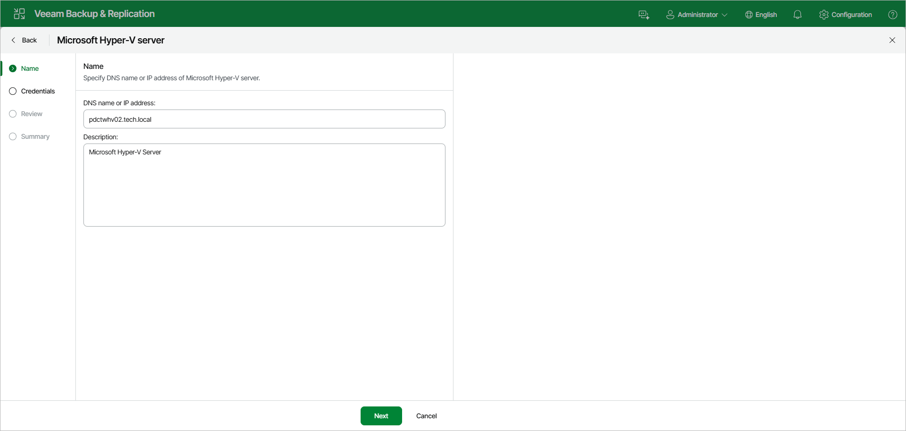

# Step 2. Specify Server Name or Address

In this article

At the Name step of the wizard, specify an address and description for the Microsoft Hyper-V server.

1. Enter a full DNS name, or IPv4 or IPv6 address of the Microsoft Hyper-V server. Note that you can use IPv6 addresses only if IPv6 communication is enabled as described in section [IPv6 Support](ipv6.md).
2. Provide a description for future reference. The default description contains information about the user who added the server, date and time when the server was added.

Page updated 8/13/2025

Page content applies to build 13.0.1.1071
