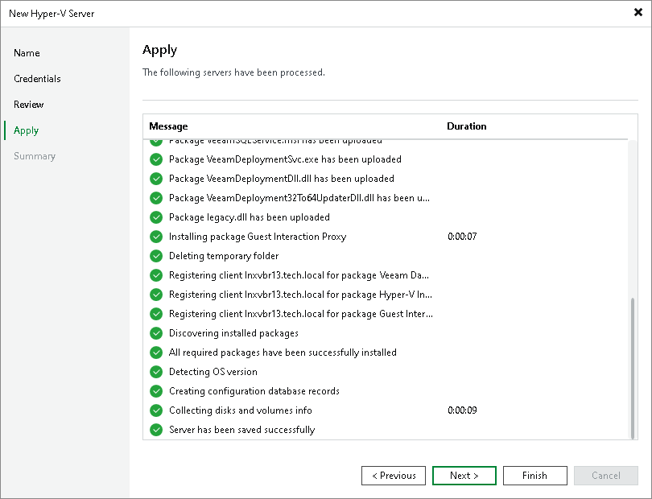

# Step 6. Finish Working with Wizard

In this article

At the Apply step of the wizard, complete the procedure of Microsoft Hyper-V server adding.

1. Review details of the Microsoft Hyper-V server.
2. Click Next, then click Finish to exit the wizard.

Page updated 8/9/2025

Page content applies to build 13.0.1.1071
