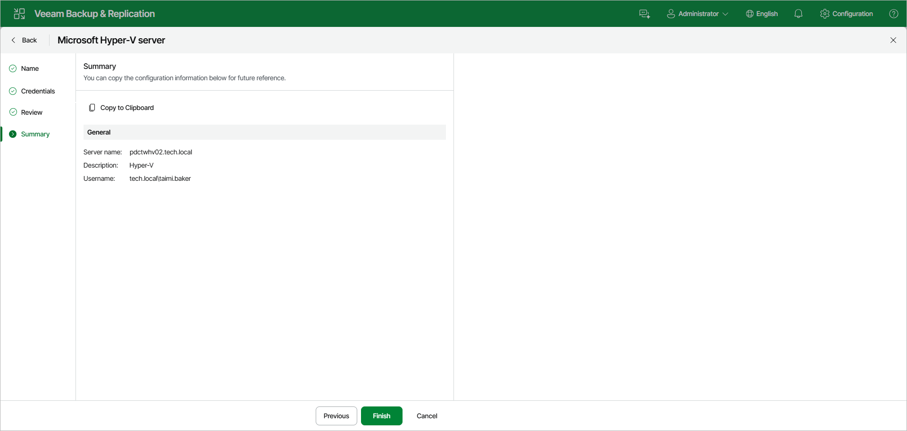

# Step 6. Finish Working with Wizard

At the Summary step of the wizard, review details of the Hyper-V server. Then click Finish to complete the procedure of adding the Hyper-V server to the backup infrastructure. Veeam Backup & Replication will install and configure all required components.

