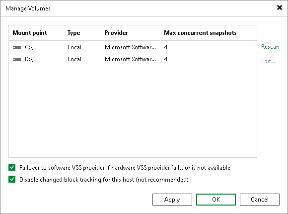
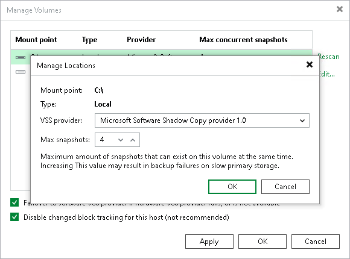
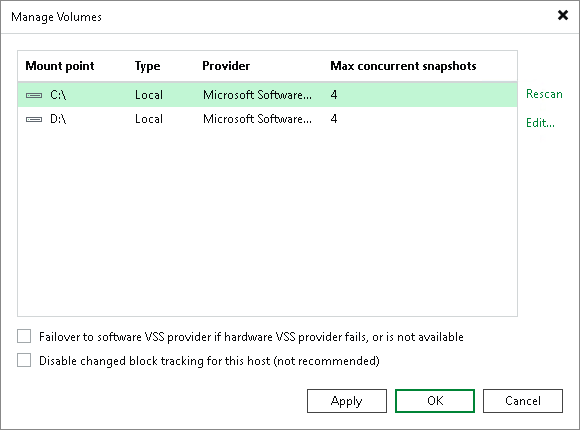

# Step 7. Specify Settings for Connected Volumes

After you add a Microsoft Hyper-V host to the backup infrastructure, you can configure the following settings for the host:

* [Enable or disable changed block tracking](hv_server_volumes.md#cbt).
* [Specify volume-specific settings](hv_server_volumes.md#volume).
* [Enable or disable failover to a software VSS provider](hv_server_volumes.md#failover).

Before you specify settings for a Microsoft Hyper-V host, you must rescan volumes of the added host. During volume rescan, Veeam Backup & Replication retrieves information about disks and volumes that are currently connected to the Microsoft Hyper-V host and writes this information to the configuration database.

Veeam Backup & Replication automatically performs volume rescan every 4 hours. You can also start volume rescan manually:

1. Open the Backup Infrastructure view.
2. In the inventory pane, select Managed servers.
3. In the working area, select the host and click Rescan on the ribbon. Alternatively, you can right-click the host and select Rescan.

|  |
| --- |
| Note |
| If you add a Hyper-V host to a cluster that is already added to your backup infrastructure, Veeam Backup & Replication may not display this Hyper-V host in the list of managed servers. To display the Hyper-V host and make it accessible from the Veeam Backup & Replication console, do the following:   * If the Hyper-V host is added to a cluster that is managed by SCVMM, right-click the SCVMM server, select Properties and go through the steps of the Edit Hyper-V Server wizard. * If the Hyper-V host is added to a cluster that is not managed by SCVMM, right-click the cluster and select Rescan.   To ensure that all Veeam Backup & Replication components on the Hyper-V host are up to date, right-click the Hyper-V host, select Properties and go through the steps of the Edit Hyper-V Server wizard. |

Changed Block Tracking Settings

By default, Veeam Backup & Replication uses changed block tracking for processing Microsoft Hyper-V VMs. You can disable changed block tracking, for example, for testing purposes.

Change block tracking is enabled and disabled at the level of the Microsoft Hyper-V host.

|  |
| --- |
| Important |
| The Disable changed block tracking for this host option does not affect changed block tracking on Microsoft Hyper-V Server 2016 and later. In this case, you can disable change block tracking at the job level. For more information on how to disable it, see [Hyper-V Settings](backup_job_advanced_hv_hv.md). |

To disable changed block tracking:

1. Open the Backup Infrastructure view.
2. In the inventory pane, select Managed servers.
3. In the working area, right-click the host and select Manage Volumes.
4. In the Manage Volumes window, select the Disable changed block tracking for this host check box.

Volume-Specific Settings

You can define volume-specific settings for a Microsoft Hyper-V host: select what VSS provider must be used for snapshot creation and specify the maximum number of concurrent snapshots that must exist for the volume.

To specify volume-specific settings:

1. Open the Backup Infrastructure view.
2. In the inventory pane, select Managed servers.
3. In the working area, right-click the host and select Manage Volumes.
4. Select the volume in the list and click Edit.

1. [For Microsoft Hyper-V 2012 R2 and earlier] To take a VSS snapshot of a specific volume, Veeam Backup & Replication uses one of VSS providers available for this volume. To explicitly define what VSS provider must be used for the volume, select the VSS provider from the VSS provider list. If a VSS provider is not set explicitly, Veeam Backup & Replication will scan the list of available VSS providers and select the most appropriate one automatically.
2. [For Microsoft Hyper-V 2012 R2 and earlier] You can simultaneously store 4 snapshots of one volume. To change this number, specify the Max snapshots value. It is not recommended that you increase the number of snapshots for slow storage. Many snapshots existing at the same time may cause VM processing failures.

[For Microsoft Hyper-V Server 2016 and later] You can simultaneously store 4 VM checkpoints on one volume. To change this number, specify the Max snapshots value. Note that this limitation works only for checkpoints created during Veeam Backup & Replication data protection tasks.

VSS Provider Failover Settings

If you have selected to use a hardware VSS provider, Veeam Backup & Replication uses the specified hardware VSS provider for volume snapshot creation. If the hardware VSS provider does not manage to create a volume snapshot for some reason, Veeam Backup & Replication automatically fails over to a software VSS provider.

By default, the failover option is enabled. To disable failover to a software VSS provider:

1. Open the Backup Infrastructure view.
2. In the inventory pane, select Managed servers.
3. In the working area, right-click the host and select Manage Volumes.
4. In the Manage Volumes window, clear the Failover to Software VSS Provider if hardware VSS Provider fails, or is not available check box.

