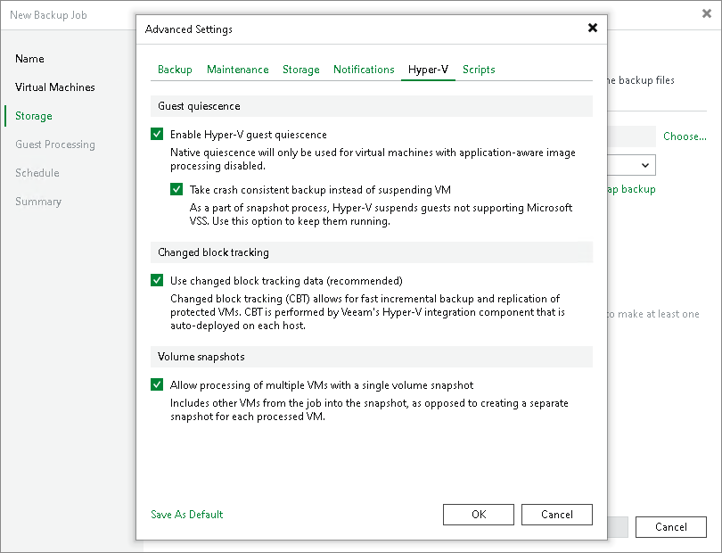

# Microsoft Hyper-V Guest Quiescence

In this article

When you back up or replicate a running VM, you need to quiesce or ‘freeze’ the VM to bring its file system and application data to a consistent state. Data quiescence is crucial for highly-transactional applications. It helps create transactionally consistent backups or replicas and guarantees safety of application data.

To create transactionally consistent backups and replicas for VMs that do not support Microsoft VSS (for example, Linux VMs), you must enable Microsoft Hyper-V guest quiescence for the job. In this case, Veeam Backup & Replication will use a native Microsoft Hyper-V approach to quiesce the VM. Microsoft Hyper-V guest quiescence helps freeze the file system and application data on the VM and create a stable shadow copy of the volume where VM data resides.

|  |
| --- |
| Note |
| To create consistent backups for such VMs, applications should be prepared using special pre-freeze and post-thaw scripts that you should create and store on the backup server beforehand. When the job starts, Veeam Backup & Replication will upload these scripts to the appropriate folders on VM guest. For more information, see [Pre-Freeze and Post-Thaw Scripts](pre_post_scripts_hv.md). |

To quiesce the VM, Veeam Backup & Replication can use the following methods:

* Online backup (Microsoft Hyper-V method)
* Offline backup (Microsoft Hyper-V method)
* Crash-consistent backup (Veeam method)

The quiescence method is selected in the following way:

* If a VM meets all requirements for online backup, Veeam Backup & Replication will use the online backup method.
* If a VM does not meet the requirements for online backup, Veeam Backup & Replication will use the offline backup method. During offline backup, a VM is suspended for a short period of time.

If you do not want to suspend the VM, you can instruct Veeam Backup & Replication to create a crash-consistent backup instead of creating a transactionally consistent backup with the offline backup method.

Microsoft Hyper-V guest quiescence is enabled at the job level for all VMs added to the job. By default, this option is disabled.

|  |
| --- |
| Note |
| Consider the following:   * Offline backup is not applicable to VMs registered on Microsoft Hyper-V Server 2016 or later. * By default, Veeam Backup & Replication uses [application-aware processing](application_aware_processing_hv.md) when both Microsoft Hyper-V guest quiescence and application-aware processing are enabled. If some VMs cannot be quiesced with application-aware processing or it is disabled for specific VMs in the job (the Disable application processing is set for VMs in the job settings), Veeam Backup & Replication uses Microsoft Hyper-V guest quiescence to prepare these VMs for backup or replication. |

Page updated 3/3/2025

Page content applies to build 13.0.1.1071
