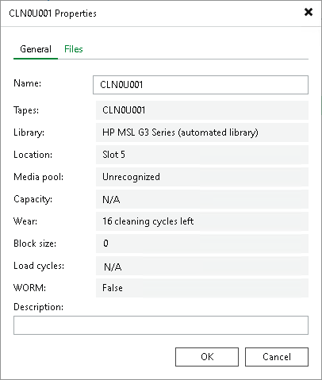

# Viewing Tape Properties

You can view properties of each tape registered in Veeam database. The tapes may be online or offline. The Properties window shows location, capacity, name and other properties of the selected tape.

Tape Capacity

The capacity of the tape is identified by the tape device where the tape is located. You can also view the capacity of a tape in your tape device console (or in the Microsoft Windows Device Manager for tapes that are in drives).

Tape Name

The name of the tape is generated automatically during tape importing. If your tape device supports barcodes, Veeam Backup & Replication will use the barcodes to identify the tapes and display the barcode as the Name property of the tape. If a tape does not have a barcode, Veeam Backup & Replication will automatically create the tape name using the pattern 'Tape N'.

|  |
| --- |
| Important |
| "CLN" and "CLR" prefixes are reserved for cleaning tapes. Veeam Backup & Replication regards tapes with such prefixes as cleaning tapes.  Make sure that the regular tapes intended for writing data do not have barcodes starting with "CLN" or "CLR". If they do, rename the tapes and inventory the tape library. |

If necessary, you can change the name of a tape:

1. Open the Tape Infrastructure view.
2. Navigate to the list of tapes either under Media Pools or under Libraries > LibraryName node > Media > Online/Offline.
3. Select the tape you want to rename and click Properties on the ribbon. Alternatively, you can right-click the tape and select Properties.
4. Change tape name and description as required.
5. Click OK to save changes.

|  |
| --- |
| Note |
| If you manage several tape libraries on the same Veeam backup server and use barcodes to identify tapes in these libraries, make sure that all barcodes are unique. If some tapes have identical barcodes, Veeam Backup & Replication may fail to manage them correctly. |

Tape Usage Statistics

Tapes wear off gradually every time they are rewritten. When a tape reaches the maximum times of reuse (set by manufacturer), the tape becomes retired. Veeam Backup & Replication automatically moves retired tapes to the Retired media pool. For more information, see [Service Media Pools](service_media_pools.md).

Veeam Backup & Replication creates tape usage statistics for each tape based on read and write activity and the size of the tape. When Veeam Backup & Replication selects a tape for a job, it considers the tape usage statistics among other criteria. For a job, a tape with minimal usage is selected.

You can view the tape usage statistics in the Wear field of the Tape Properties window.

For cleaning tapes, you can view the remaining cleaning cycles in the Wear field of the Tape Properties window. The information about the remaining cleaning cycles becomes available only once the first cleaning cycle is finished.

