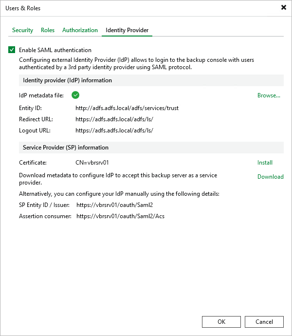
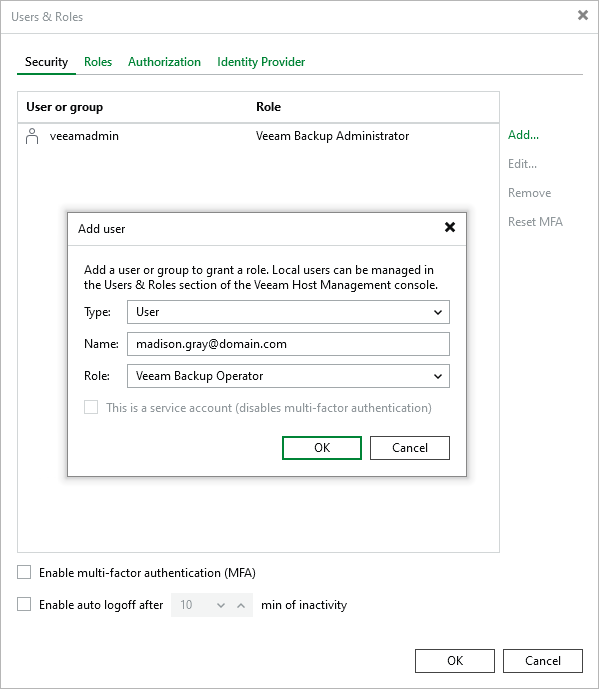

# SAML Authentication

Veeam Backup & Replication supports single sign-on authentication based on the SAML 2.0 protocol. Enterprise organizations that use a single sign-on (SSO) service in their IT infrastructure can extend single sign-on capabilities to Veeam Backup & Replication. A user of the organization logged in to the single sign-on service can access Veeam Backup & Replication if their account was added by the Veeam backup administrator.

SAML authentication scenario involves the following parties:

* User that logs in to the Veeam Backup & Replication console or Veeam Backup & Replication Web UI.
* Service provider (SP) — an application accessed by the user. In the Veeam backup infrastructure, the service provider is Veeam Backup & Replication.
* Identity provider (IdP) — an external service (hosted on premises or in the public cloud) that facilitates SSO. The IdP keeps user identity data in a user store (or attribute store). Upon requests from the SP, the IdP issues SAML authentication assertions, that is, identifies the user and provides the SP with the required information about the user.

The SP and IdP exchange information in the XML format in accordance with the [SAML V2.0 Standard](https://wiki.oasis-open.org/security/FrontPage#SAML_V2.0_Standard).

|  |
| --- |
| Tip |
| The list of tested identity providers includes the following vendor product lines:   * Microsoft Active Directory Federation Services * Microsoft Entra ID * Okta Workforce Identity Cloud * Okta Auth0 * Keycloak * Cyberark Identity * Thales SafeNet Trusted Access * Entrust Identity as a Service |

How SAML Authentication Works

Veeam Backup & Replication supports the following scenario for SAML authentication:

1. A Veeam backup administrator adds an external user account in the Security tab of the Users & Roles window and assigns a role to this user. For more information, see [Adding External Users](#add_external_user).
2. A user runs the Veeam Backup & Replication console or opens the Veeam Backup & Replication Web UI.
3. On the sign-in page, the user clicks Sign in with SSO.
4. Veeam Backup & Replication redirects a SAML authentication request to the IdP. If the user has not previously logged in with the single sign-on service, the IdP redirects the user to the URL of the single sign-on service.

|  |
| --- |
| Note |
| If the user logs in to the desktop application, they must authenticate in the single sign-on service every time. For the web UI, the user logs in automatically until the authorization cookie expires. |

1. After the user authenticates in the single sign-on service, the IdP issues a SAML assertion and redirects it to Veeam Backup & Replication in the SAML response.
2. The user gains access to Veeam Backup & Replication and can perform operations according to the assigned role.

Configuring SAML Authentication

Depending on your identity provider, SAML authentication configuration could require steps that are not listed in this section. For information on how to configure Microsoft Entra ID, see [Configuring SAML Authentication for Microsoft Entra ID](identity_provider_entra_id.md). If you use an alternative identity provider, consult their documentation.

To configure SAML authentication on the Veeam Backup & Replication side, perform the following steps:

1. Get an XML metadata file from your IdP.
2. From the main menu, select Users & Roles.
3. In the User and Roles window, select the Identity Provider tab.
4. Select the Enable SAML authentication check box.
5. In the Identity provider (IdP) information section, specify the IdP metadata file. To do this, click Browse and select the file.
6. In the Service Provider (SP) information section, do the following:

1. Select a certificate to use. By default, the current Veeam Backup & Replication server certificate is used. Your IdP uses this certificate to validate requests from the Veeam Backup & Replication server. To use a different certificate, click Install and select an existing certificate from the certificate store or import a certificate from a file. For more information, see [Backup Server Certificate](backup_server_certificate.md).
2. Click Download to get the service provider settings for your IdP. Veeam Backup & Replication exports the XML metadata file together with a separate file that contains the public part of the SP certificate. Use the metadata file to add the Veeam Backup & Replication server as the service provider in your IdP configuration. You can provide the certificate file to your IdP separately, for example, after you change the certificate.

1. Click OK.

Adding External Users

After you configure SAML authentication, you must add any external users or groups you want to use to Veeam Backup & Replication and assign roles to them. To do this, perform the following steps:

1. From the main menu, select Users & Roles.
2. In the User & Roles window, select the Security tab.
3. Click Add > External user or group.
4. From the Type drop-down list, select User or Group.
5. In the Name field, enter the group name or user name in the UPN format, for example, john.doe@domain.com.
6. From the Role drop-down list, select the role that you want to assign to this user or group.
7. Click OK.

Page updated 2026-07-10

