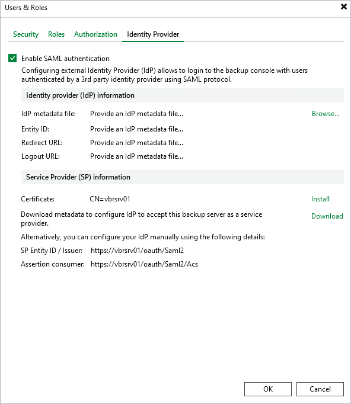
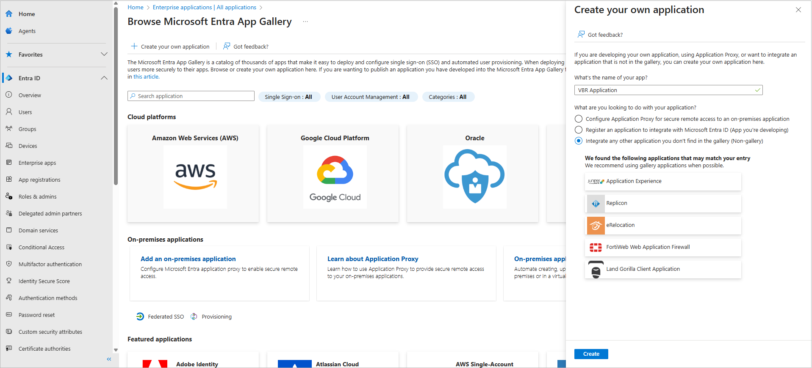
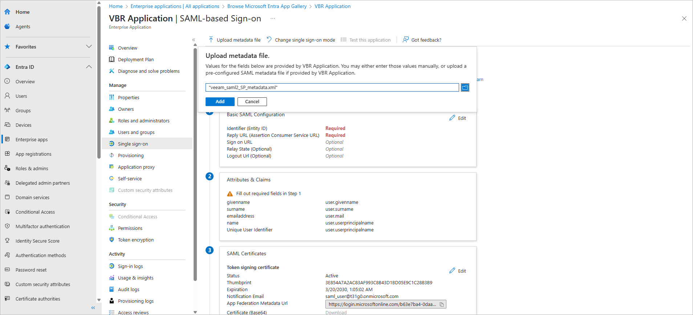
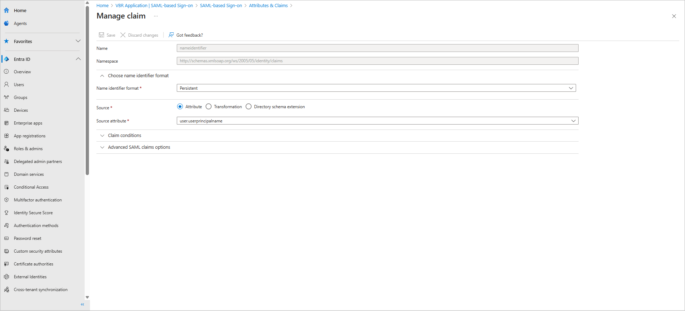
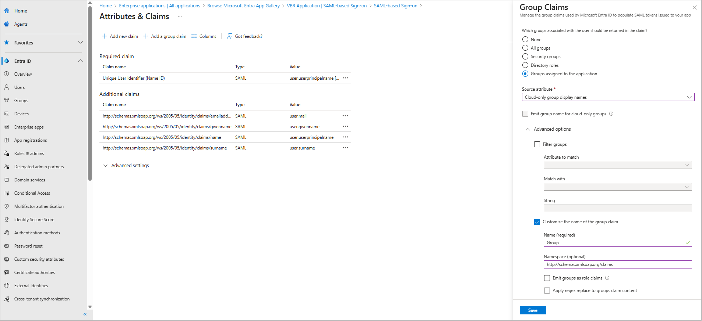
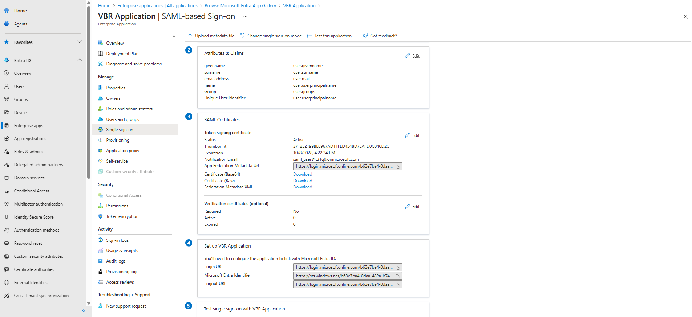
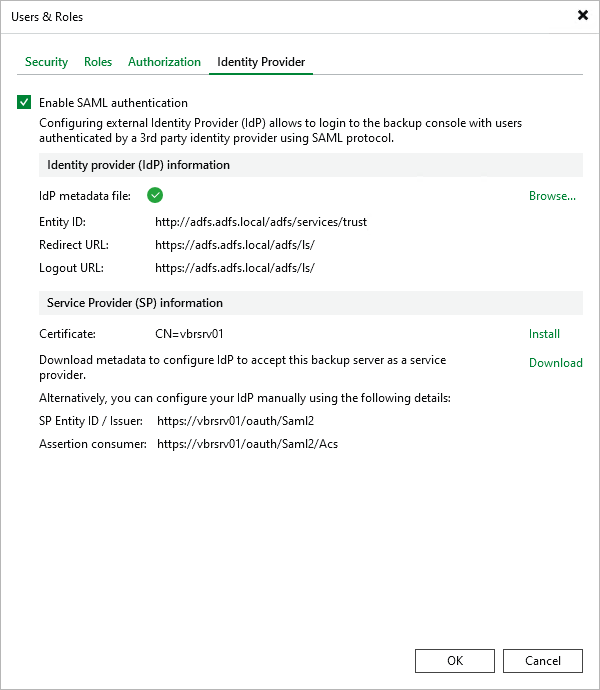
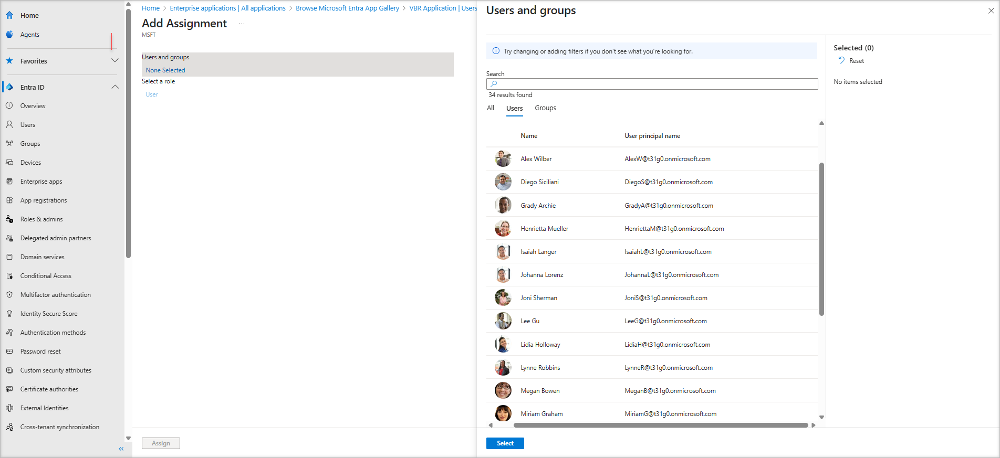

# Configuring SAML Authentication for Microsoft Entra ID

For Veeam Backup & Replication to be able to use Microsoft Entra ID as an identity provider, you must perform the steps described in this section.

Step 1. Obtain Service Provider Settings

To obtain the service provider authentication settings, do the following:

1. From the main menu, select Users and Roles.
2. In the User and Roles window, select the Identity Provider tab.
3. Select the Enable SAML authentication check box.
4. In the Service Provider (SP) information section, do the following:

1. Click Install to specify a valid server certificate. You can select an existing backup server certificate from the certificate store or import a certificate from a file. For more information, see [Backup Server Certificate](backup_server_certificate.md).
2. Click Download to get an XML metadata file for Microsoft Entra ID. Alternatively, you can copy the service provider settings manually.

|  |
| --- |
| Tip |
| A service provider certificate is required to validate connections from the backup server to Microsoft Entra ID. The default Veeam Backup Server Certificate can be used for this. |

Step 2. Set up Single Sign-On with SAML for Microsoft Entra ID application

To set up single sign-on (SSO) with SAML in your Microsoft Entra ID, do the following:

1. Log in to the [Microsoft Entra ID portal](https://entra.microsoft.com/).
2. Navigate to Enterprise applications and click New application > Create your own application.
3. In the Create your own application window, specify a name for your Microsoft Entra ID application and select the Integrate any other application you don't find in the gallery (Non-gallery) option.
4. In the newly created application, navigate to Single sign-on and click SAML.

Step 3. Forward Service Provider Settings to Microsoft Entra ID

To forward the service provider authentication settings to your Microsoft Entra ID, do the following:

1. In the Single sign-on window of your Microsoft Entra ID application, click Upload metadata file.
2. In the Upload metadata file window, click the folder icon to locate the metadata file with the service provider settings you downloaded.
3. Click Add.
4. In the Basic SAML Configuration window, click Save.

Step 4. Create Claim for Microsoft Entra ID application

To authenticate an SSO user, Microsoft Entra ID sends a SAML authentication response to Veeam Backup & Replication. The SAML response contains an attribute that will be used by Veeam Backup & Replication to identify the user. To send the attributes required for user or group-based authentication, you must create the appropriate claim in Microsoft Entra ID.

To be able to authenticate SSO users in Veeam Backup & Replication, do the following:

1. In the Single sign-on window of your Microsoft Entra ID application, locate the Attributes & Claims section and click Edit.
2. Click Unique User Identifier (Name ID).
3. In the Manage claim window, set the Name Identifier Format to Persistent.

To be able to use group-based SSO authentication in Veeam Backup & Replication, do the following:

1. In the Single sign-on window of your Microsoft Entra ID application, locate the Attributes & Claims section and click Edit.

1. Click Add a group claim.
2. In the Group Claims window, select Groups assigned to the application.
3. In the Source attribute drop-down menu, select Cloud-only group display names.
4. In Advanced options:

1. Select the Customize the name of the group claim check box.
2. Specify Group in the Name field.
3. Specify http://schemas.xmlsoap.org/claims in the Namespace field.

1. Click Save.

Step 5. Obtain Microsoft Entra ID Metadata

To obtain the Microsoft Entra ID identity provider settings, do the following:

1. In the Single sign-on window of your Microsoft Entra ID application, locate the Federation Metadata XML field in the SAML Certificates section.
2. Click Download.

Step 6. Import Microsoft Entra ID Metadata

To import the obtained Microsoft Entra ID identity provider settings to Veeam Backup & Replication, do the following:

1. From the main menu, select Users and Roles.
2. In the User and Roles window, select the Identity Provider tab.
3. In the Identity provider configuration section:

1. In the Identity Provider information section, click Browse to locate the federation metadata file with the identity provider settings.
2. Click Open

Step 7. Assign SSO Users

To assign users that will be able to access Veeam Backup & Replication using SSO, do the following:

1. In the Single sign-on window of your Microsoft Entra ID application, navigate to Users and groups.
2. Click Add user/group.
3. In the Add assignment window, click None selected and select users in the Users list.
4. Click Assign.

Step 8. Add External User or Group

To add external users or groups to Veeam Backup & Replication and assign roles to them, do the following:

1. From the main menu, select Users and Roles.
2. In the User and Roles window, select the Security tab.
3. Click Add > External user or group.
4. From the Type drop-down list, select User or Group.
5. In the Name field, enter the group name or user name in the UPN format, for example, john.doe@domain.com.
6. From the Role drop-down list, select the role that you want to assign to this user or group.
7. Click OK.

