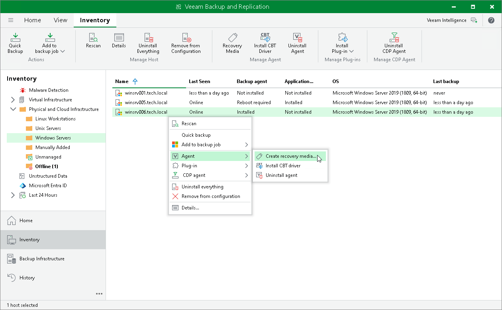

# Step 1. Launch Create Recovery Media Wizard

To launch the Create Recovery Media wizard:

1. Open the Inventory view.
2. In the inventory pane, expand the Physical and Cloud Infrastructure node and select a protection group that contains the necessary protected computer.
3. In the working area, select the computer and click Recovery Media on the ribbon or right-click the computer and select Agent > Create recovery media.

|  |
| --- |
| TIP |
| You can also launch the Create Recovery Media wizard from the Backups node in the Home view of the Veeam backup console. To learn more, see [Creating Recovery Media from Backup](agent_backup_create_image.md). |

