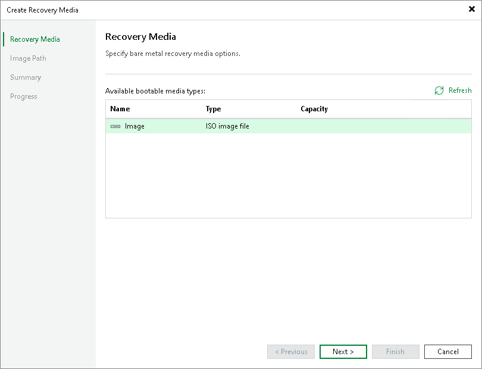

# Step 2. Specify Recovery Media Options

At the Recovery Media step of the wizard, in the Available bootable media types list, specify on which type of media you want to create a recovery image. You can create the following types of recovery images:

* Recovery image on a removable storage device. You can create a recovery image on a USB drive, SD card and so on. Veeam Backup & Replication displays all removable storage devices currently attached to the backup server. Select the necessary one in the list.
* ISO file with the recovery image. You can create a recovery image in the ISO file format and save the resulting file locally on the backup server.

|  |
| --- |
| NOTE |
| When you create a recovery image from the Veeam backup console, you cannot specify additional recovery media options in the same way as when you create a recovery image on the Veeam Agent computer. In this scenario, the recovery image is created with default settings: Veeam Backup & Replication includes network connection settings and hardware drivers installed on the Veeam Agent computer in the recovery image. |

