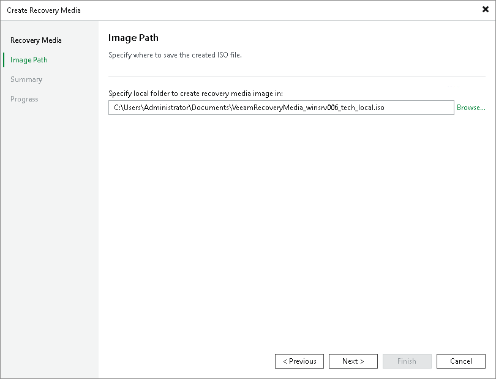

# Step 3. Specify Path to ISO

The Image Path step of the wizard is available if you have selected to create an ISO file with the recovery image.

In the Specify folder to create recovery media image in field, specify a real path to the folder where you want to save the created recovery image, and the ISO file name. When you create Veeam Recovery Media using the Veeam Backup & Replication console, you can save the ISO file on the local drive of the server where the Veeam Backup & Replication console is installed only.

You cannot save the ISO file in a shared folder. Thus, the recovery image will always be available should Veeam Agent computer volumes get corrupted or the computer fail to start.

