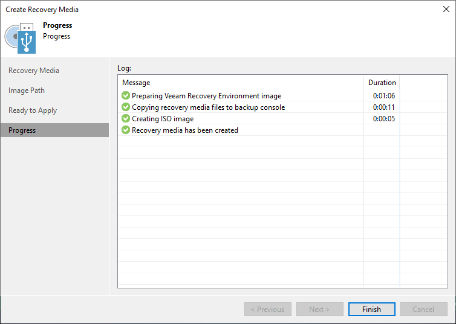

# Step 5. Finish Working with Wizard

The process of recovery image creation may take some time. Wait for the process to complete and click Finish to exit the wizard.

If you want to interrupt the process of recovery image creation, click Cancel or close the wizard window.

