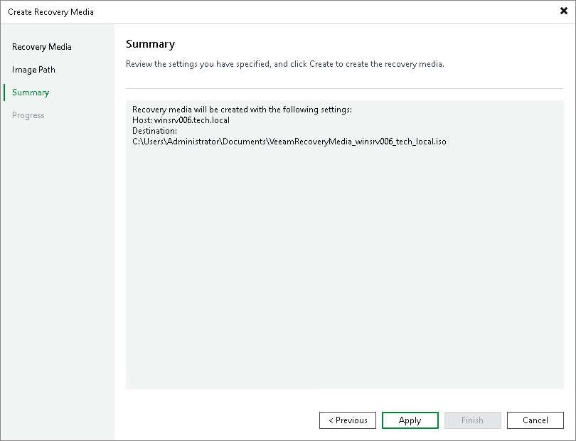

# Step 4. Review Recovery Image Settings

In this article

At the Summary step of the wizard, review settings of the recovery image that you plan to create and click Apply.

Veeam Backup & Replication will collect data necessary for recovery image creation and write the resulting recovery image to the specified target.

Page updated 11/14/2025

Page content applies to build 13.0.1.1071
