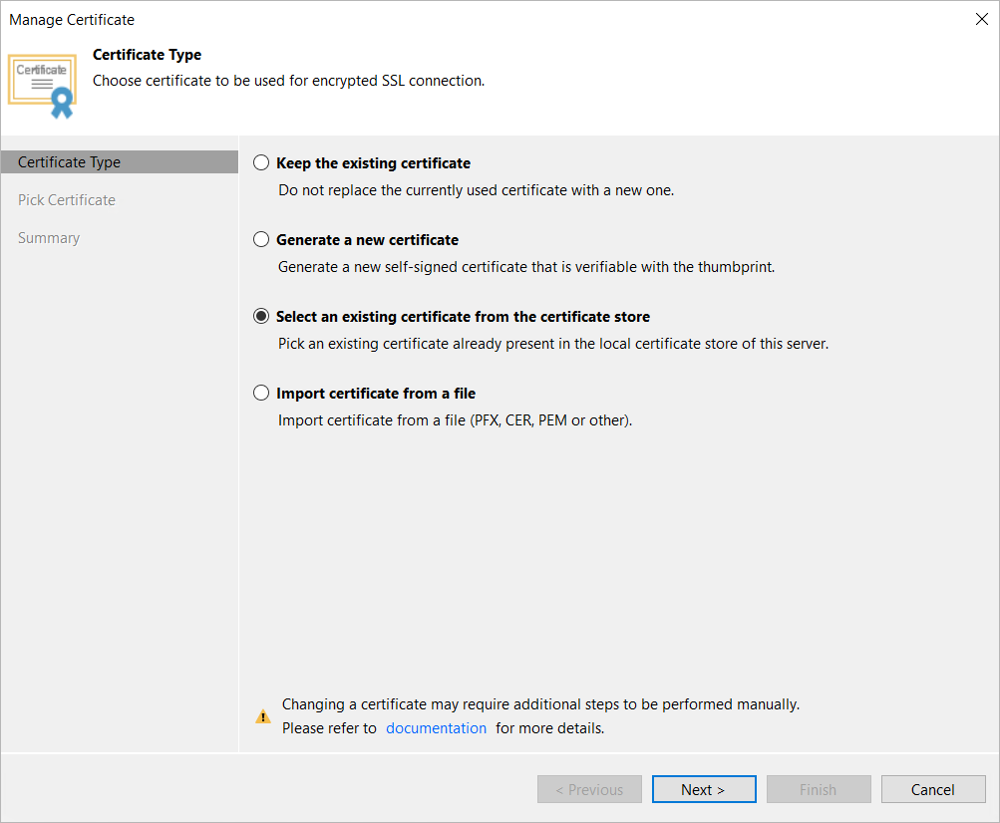
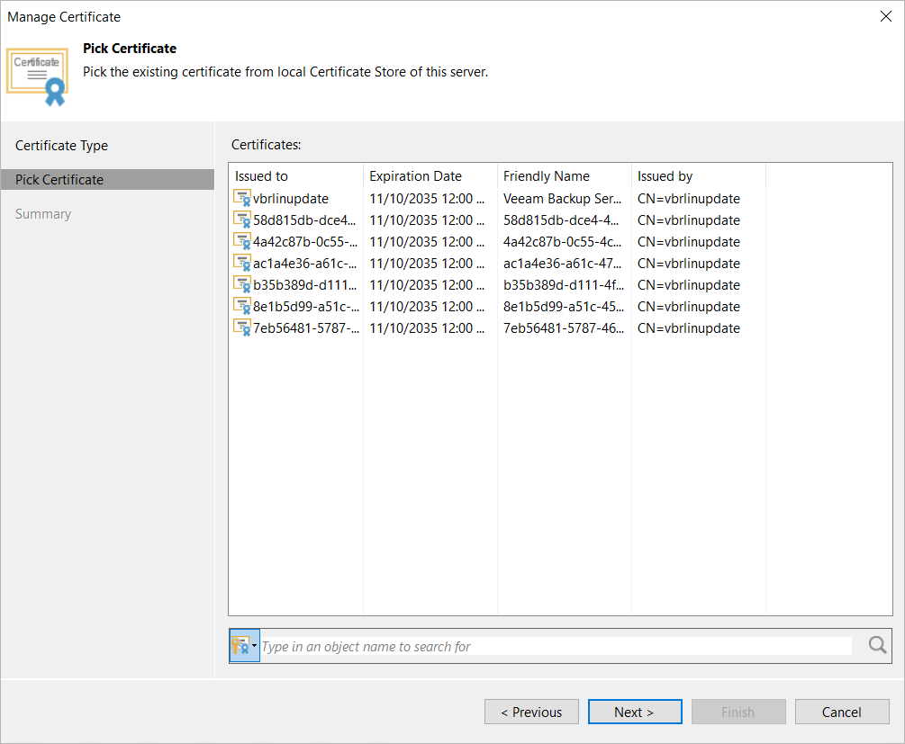

# Importing Certificate from Certificate Store

If the Veeam backup server has been issued a TLS certificate signed by a CA and the TLS certificate is located in the Veeam Backup & Replication server certificate store, you can use this certificate for authenticating parties in the Veeam Backup & Replication infrastructure.

|  |
| --- |
| Important |
| If you update the TLS certificate used on the backup server, you must also update info about the certificate on the specific backup infrastructure components as described in section [Backup Server Certificate](backup_server_certificate.md). |

To select a certificate from the certificate store, do the following:

1. From the main menu, select Options.
2. Click the Security tab.
3. In the Security tab, click Install.
4. At the Certificate Type step of the wizard, choose Select certificate from the Certificate Store.

1. At the Pick Certificate step of the wizard, select a TLS certificate that you want to use. You can select only certificates that contain both a public key and a private key. Certificates without private keys are not displayed in the list.

1. At the Summary step of the wizard, review the certificate properties.
2. Click Finish to apply the certificate.

