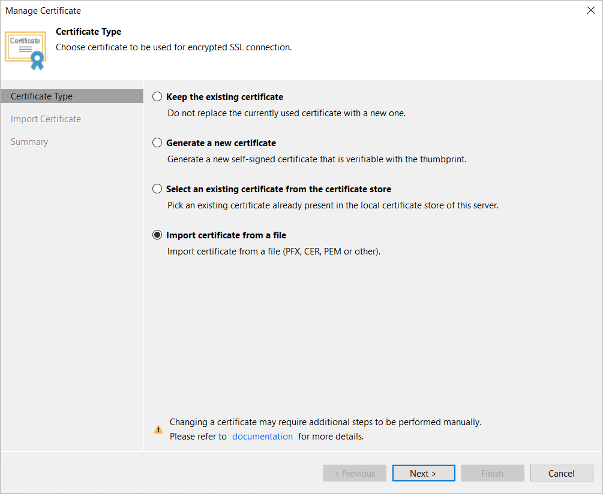
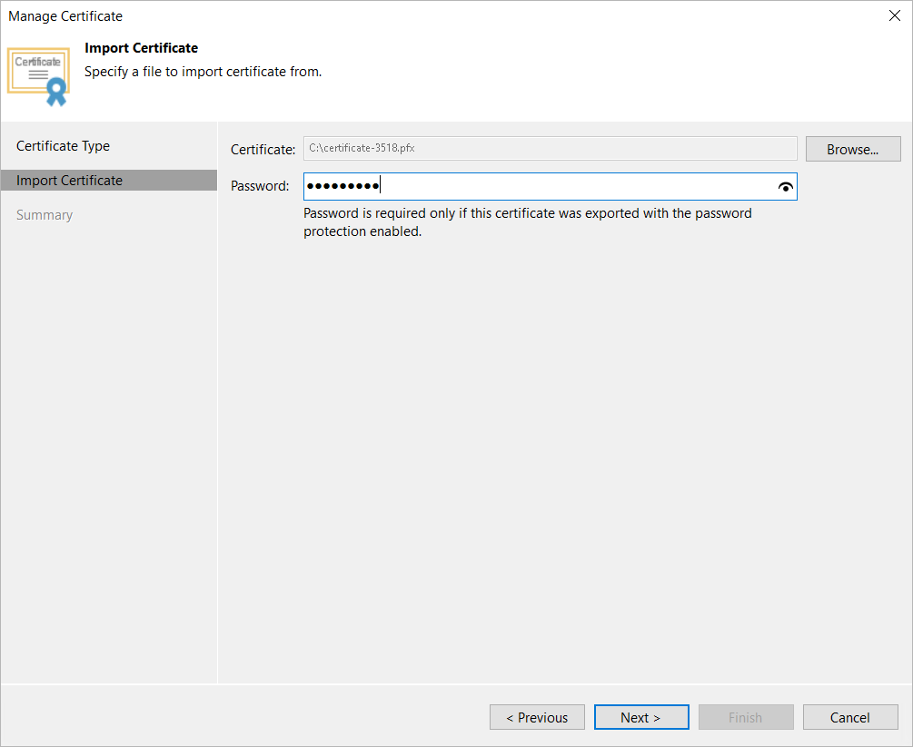

# Importing Certificate from PFX Files

You can import a TLS certificate in the following situations:

* Your organization uses a TLS certificate signed by a CA and you have a copy of this certificate in a file of PFX format.
* You have generated a self-signed TLS certificate in the PFX format with a third-party tool and you want to import it to Veeam Backup & Replication.

|  |
| --- |
| Note |
| Consider the following:   * The TLS certificate must pass validation on the Veeam backup server. Otherwise, you will not be able to import the TLS certificate. * If a PFX file contains a certificate chain, only the end entity certificate will be imported. |

|  |
| --- |
| Important |
| If you update the TLS certificate used on the backup server, you must also update info about the certificate on the specific backup infrastructure components as described in section [Backup Server Certificate](backup_server_certificate.md). |

To import a TLS certificate from a PFX file, do the following:

1. From the main menu, select Options.
2. Click the Security tab.
3. In the Security tab, click Install.
4. At the Certificate Type step of the wizard, choose Import certificate from a file.

1. At the Import Certificate step of the wizard, specify a path to where the PFX file is stored on the Veeam Backup & Replication console machine.
2. If the PFX file is protected with a password, specify the password in the Password field.

1. At the Summary step of the wizard, review the certificate properties. Use the Copy to clipboard link to copy and save information about the TLS certificate. You can use the copied information on a protected computer to verify the TLS certificate with the certificate thumbprint.
2. Click Finish to apply the certificate.

