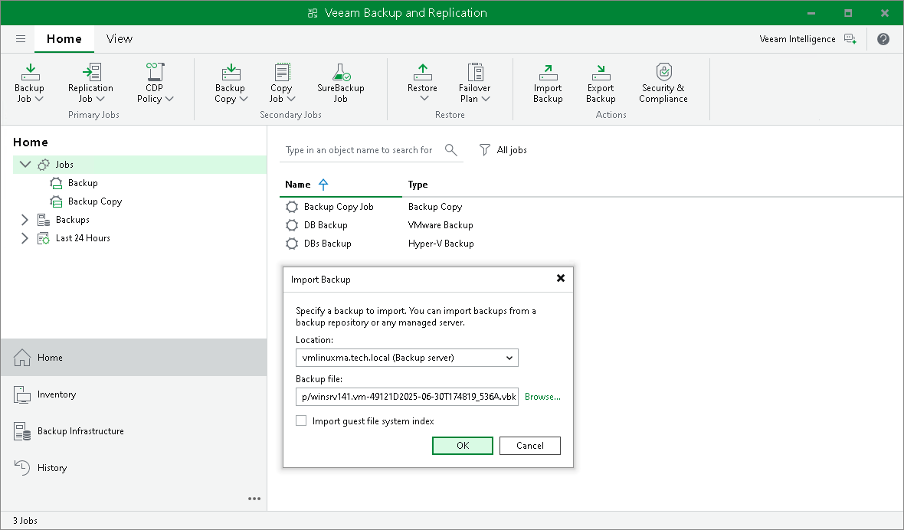

# Importing Backups Manually

In this article

You may need to import backups to Veeam Backup & Replication in the following situations:

* The backup server has failed and you have restored it in a new location. You want to restore VM data from backups created by the backup server that has failed.
* You want to restore VM data from backups created on another backup server.
* You want to restore VM data from backups in the backup repository that is not added to the backup infrastructure (for example, if you removed it earlier).
* You want to restore VM data from VeeamZIP files created on your backup server or another backup server.

The imported backup becomes available in the Veeam Backup & Replication console. You can use any restore operation to recover VM data from this backup.

Considerations and Limitations

Before you import a backup, consider the following:

* In the Veeam Backup & Replication console, you can import backups from the following types of repositories: [Microsoft Windows servers](ms_server.md), [Linux servers](linux_server.md), [HPE StoreOnce](deduplicating_appliance_storeonce.md) and [Dell Data Domain](dell_dd.md) deduplicating storage appliances. To import files from other types of repositories, use the Import-VBRbackup cmdlet as described in the [Veeam PowerShell Reference](https://helpcenter.veeam.com/docs/vbr/powershell/import-vbrbackup.html?ver=13).
* The server from which you plan to import backups must be added to the backup infrastructure. Otherwise, you will not be able to access backup files.
* To be able to restore VM data from previous backup restore points, ensure you have all required incremental backup files (forward or reverse) in the same folder where the full backup file resides.
* You can import backups created by a later Veeam Backup & Replication version. However, restore operations for this backup will not be available.

Importing Backups Manually

To import a backup to the Veeam Backup & Replication console:

1. On the Home tab, click Import Backup.
2. From the Location list, select the server on which the backup you want to import is stored.
3. Click Browse and select the necessary VBM or VBK file. If you select the VBM file, the import process will be notably faster. It is recommended that you select the VBK file only if the VBM file is not available.
4. By default, index data of the VM guest OS file system is not imported with the backup to speed up the import process. If you want to import index data, select the Import guest file system index check box.
5. Click OK to import the backup. The imported backup will be displayed in the Home view, under the Backups > Imported node in the [inventory pane](vbr_ui.md). Backups are imported using the original name of the backup job with the \_imported suffix appended.

|  |
| --- |
| Tip |
| If you need to import all backups stored on a server, assign a backup repository role to it and enable import at the [Review](repository_review.md) step of the wizard. If the repository is already added to the backup infrastructure, you can rescan it. Veeam Backup & Replication will automatically import backups. For more information, see [Rescanning Backup Repositories](rescanning_backup_repositories.md).  Note that Veeam Backup & Replication will not be able to import backups if VBM files are unavailable. In this case, you will have to import backups manually using the VBK files. |

Related Topics

* [Importing Encrypted Backups](import_encrypted_hv.md)
* [Importing Transaction Logs](import_sql_logs_hv.md)
* [Importing Backup Files from Scale-Out Backup Repositories](import_sobr_hv.md)

Page updated 8/7/2025

Page content applies to build 13.0.1.1071
