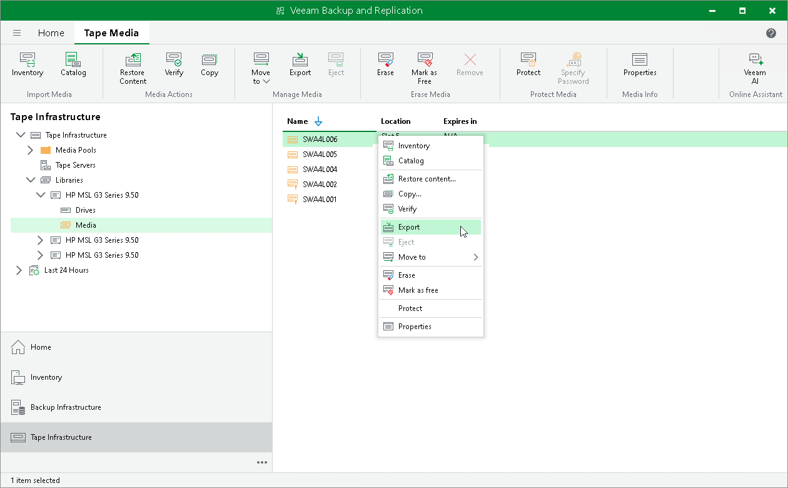

# Exporting Tapes

If you want to take the tapes out of the tape device, you need to export them first. Exporting ejects the tapes from the slots in the tape device and moves them to the I/E slot (or Mail slot). When they are in the I/E slot, you can take them from the library and, for example, carry to a storing location.

|  |
| --- |
| Note |
| Export is available only for the devices that support such operations and include I/E slot. |

To export a tape:

1. Open the Tape Infrastructure view.
2. Navigate to the list of tapes either under Media Pools or under Libraries > LibraryName node > Media > Online.
3. Select a tape you want to export and click Export on the ribbon. Alternatively, you can right-click selected tape and select Export from the shortcut menu.

|  |
| --- |
| Tip |
| You can instruct your tape jobs to export tapes automatically. To do so, navigate to the Options step of [backup to tape job](backup_to_tape_simple_options.md) or [file to tape job](files_to_tape_options.md) and select the Export current media set upon job completion check box. |

