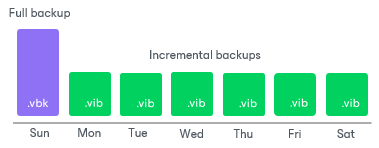
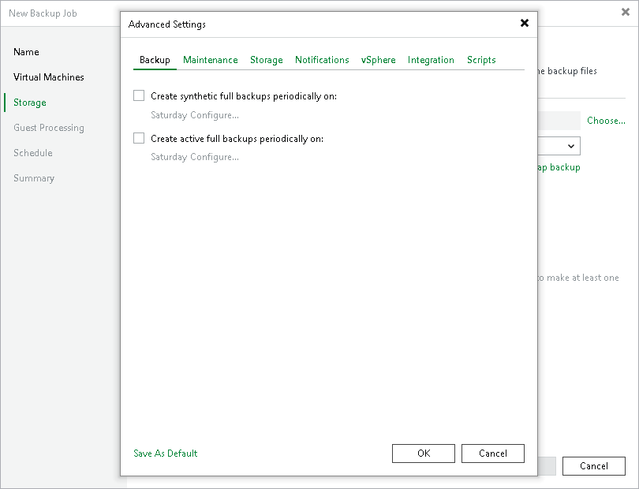

# Forever Forward Incremental Backup

The forever forward incremental backup method produces a backup chain that consists of the first full backup file (VBK) and a set of forward incremental backup files (VIB) following it.

Veeam Backup & Replication creates a forever forward incremental backup chain in the following way:

1. During the first session of a backup job, Veeam Backup & Replication creates a full backup file in the backup repository.
2. During subsequent backup job sessions, Veeam Backup & Replication copies only VM data blocks that have changed since the last backup job session (full or incremental) and saves these blocks as an incremental backup file in the backup chain.
3. After adding a new restore point to the backup chain, Veeam Backup & Replication checks the retention policy for the job. If Veeam Backup & Replication detects an outdated restore point, it transforms the backup chain to make room for the most recent restore point. For more information, see [Forever Forward Incremental Backup Retention Policy](retention_forever_incremental_hv.md).

To use the forever forward incremental backup method, you must not enable the synthetic and active full backups in the backup job settings. If you enable synthetic and active full backups, Veeam Backup & Replication will produce a [forward incremental backup chain](forward_incremental_backup.md).

Related Topics

* [Health Check for Backup Files](backup_health_check_hv.md)
* [Compact of Full Backup File](backup_compact_file_hv.md)

