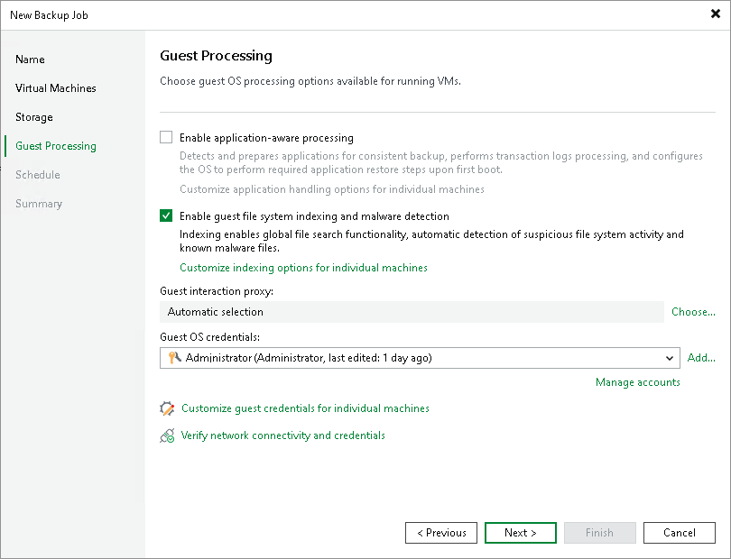

# VM Guest OS File Indexing

You can instruct Veeam Backup & Replication to create an index of files and folders on the VM guest OS during backup. VM guest OS file indexing allows you to search for VM guest OS files inside VM backups and perform a 1-click restore in Veeam Backup Enterprise Manager.

VM guest OS file indexing is enabled at the job level. You can specify granular indexing settings for every VM in the job.

|  |
| --- |
| Note |
| VM guest OS file indexing is optional. If you do not enable this option in the backup job settings, you will still be able to perform 1-click restore from the backup created by such backup job. For more information, see the [Preparing for File Browsing and Searching](https://helpcenter.veeam.com/docs/vbr/em/preparing_for_file_browsing.html?ver=13) section in the Enterprise Manager User Guide.  Note, however, that if you do not enable indexing in the backup job, during a 1-click restore from Linux and other OS backups, Veeam Backup Enterprise Manager will not display symlinks to folders in the file system browser. |

Requirements and Limitations for VM Guest OS File Indexing

Consider the following requirements and limitations for VM guest OS file indexing:

* Veeam Backup & Replication supports file indexing for VMs running Microsoft Windows and Linux OS.
* [For Linux VMs] To perform guest OS file indexing, Veeam Backup & Replication requires several utilities to be installed on the Linux VM: openssh, gzip and tar. If these utilities are not found, Veeam Backup & Replication will prompt you to deploy them on the VM guest OS.
* To store indexing data, you need enough disk space on the backup server. Indexing data comprises uncompressed index files (IFD) and one compressed GuestIndexData.zip. This ZIP file contains the compressed copies of IFD files. The file sizes are calculated in the following way:

* Each IFD file needs 50 MB of disk space per 1 million files and folders, multiplied by 2. The number of IFD files equals the number of disks on the machine.
* The size of the GuestIndexData.zip file depends on whether Veeam Backup & Replication and Veeam Backup Enterprise Manager are installed on the same machine.

* If they are on the same machine, the GuestIndexData.zip file requires 12.5 MB per 1 million files and folders, multiplied by the longest retention period — the job retention or the retention of the Enterprise Manager guest file system catalog.
* If they are on different machines, the GuestIndexData.zip file requires 12.5 MB per 1 million files and folders, multiplied by the number of days set in the job retention policy.

Keep in mind that the size of the files is approximate and may vary depending on the length of the file names on the guest OS and their paths.

Related Topics

* [Veeam Backup Catalog](indexing_catalog.md)
* [How VM Guest OS File Indexing Works](indexing_hiw.md)
* [Creating Backup Jobs](backup_job.md)

