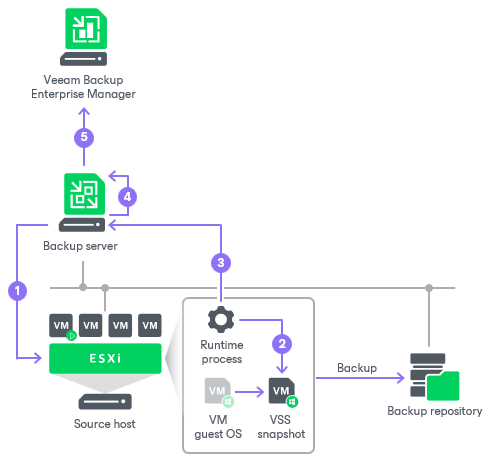

# How VM Guest OS File Indexing Works

In this article

When you run a backup job with the file indexing option enabled, Veeam Backup & Replication performs the following operations:

1. When the backup job starts, Veeam Backup & Replication connects to the VM whose file system must be indexed and deploys non-persistent runtime components or connects to (if necessary, deploys) persistent agent components inside this VM. These components are responsible for coordinating indexing activities inside the VM.
2. The non-persistent runtime components or persistent agent components start indexing the VM file system. The indexing procedure is carried out in parallel with the backup procedure. If indexing takes too long, Veeam Backup & Replication will not wait for the indexing procedure to complete. It will start copying VM data and continue file indexing inside the VM. If you have enabled application-aware processing for the VM, Veeam Backup & Replication performs indexing using the VSS snapshot, not the VM guest OS itself. As a result, the created file index exactly reflects the state of the backed-up VM.
3. When file indexing is complete, the non-persistent runtime components or persistent agent components collect indexing data and write it to the GuestIndexData.zip file. The GuestIndexData.zip file is stored in a temporary folder on the backup server.
4. When the backup job is complete, Veeam Backup & Replication notifies the local Veeam Guest Catalog Service, and the service saves indexing data in the Veeam Catalog folder on the backup server.
5. During the next catalog replication session, the global Veeam Guest Catalog Service replicates data from the backup server to the Veeam Catalog folder on the Veeam Backup Enterprise Manager server.

Page updated 3/4/2025

Page content applies to build 13.0.1.1071
