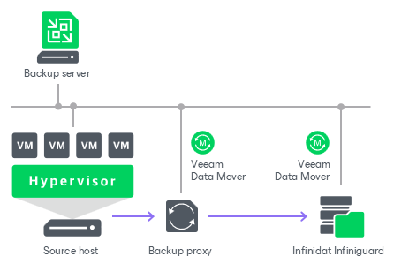
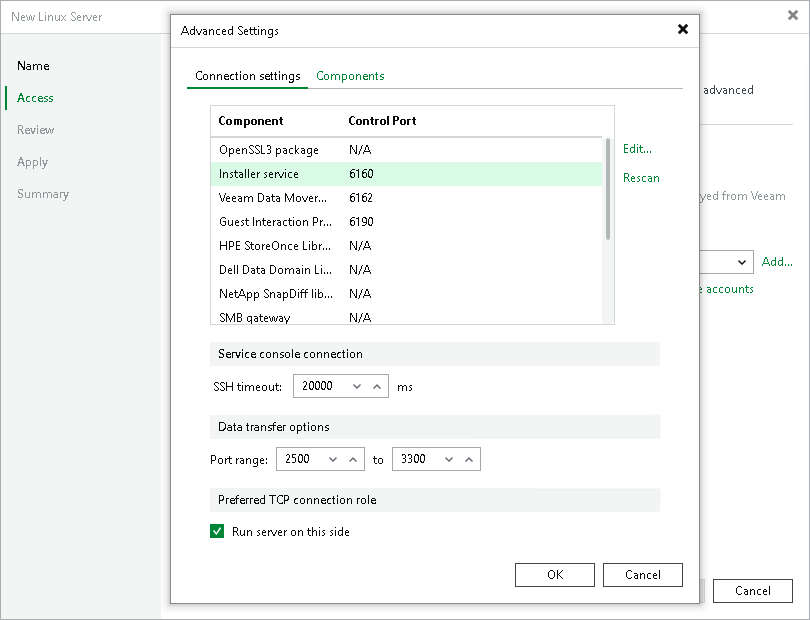

# Infinidat InfiniGuard

In this article

You can use Infinidat InfiniGuard appliances as backup repositories.

Infinidat InfiniGuard Deduplication

Infinidat InfiniGuard appliances use Infinidat InfiniGuard data deduplication technology. During backup data transfer, Infinidat InfiniGuard analyses blocks in a data stream. Instead of copying redundant data blocks Infinidat InfiniGuard uses reference pointers to existing blocks on the storage device.

Backup Infrastructure

To communicate with Infinidat InfiniGuard, Veeam Backup & Replication uses [Veeam Data Movers](veeam_transport_service.md). They connect to each other, process data and transfer it over LAN or WAN.

Veeam Backup & Replication uses the following Veeam Data Movers:

* Veeam Data Mover on the Infinidat InfiniGuard appliance

* [[For Hyper-V on-host backup](onhost_backup.md)] Veeam Data Mover on the Hyper-V host
* [[For Hyper-V off-host backup](offhost_backup.md)] Veeam Data Mover on the off-host backup proxy
* [For VMware vSphere] Veeam Data Mover on the VMware backup proxy

Infinidat InfiniGuard hosts Veeam Data Mover permanently. Veeam Backup & Replication installs the [persistent Veeam Data Mover](veeam_transport_service.md) during the initial connection to the appliance and then reuses the data mover when needed. This eliminates the need for runtime components and reduces potential security exposure.

|  |
| --- |
| Note |
| Since Veeam Backup & Replication version 12, deduplicating storage appliances use the TLS connection. For Microsoft Windows-based backup server, you can disable the TLS connection with a registry value for the deduplicating storage appliances that do not support the TLS connection. For Linux-based backup server, you can disable the TLS connection by editing the configuration file. For more information, see [this Veeam KB article](https://www.veeam.com/kb4429). |

Configuration on Infinidat InfiniGuard Side

Create at least one share on each Infinidat InfiniGuard appliance. Enable VDMS (Veeam Data Mover Service) for the created share. Leave default compression and deduplication settings for the share.

|  |
| --- |
| Note |
| When adding credentials for Infinidat InfiniGuard, use only lower case symbols for the user name. |

Configuration on Veeam Backup & Replication Side

On the Veeam Backup & Replication side, do the following:

1. Add credentials for the Infinidat InfiniGuard user account you created in the previous steps. For more information, see [SSH Credentials](credentials_manager_linux.md).

|  |
| --- |
| Note |
| Make sure that you use the UPN format for an Active Directory account user name (for example, john.doe@domain.local), and enter the user name in lowercase letters only. |

In the Credentials window, you must specify the SSH port that will be used to connect to the appliance.

The port number depends on the number of a Veeam container that you want to use. To see the available containers, go to Configuration -> System -> App Environment.

|  | Port |
| --- | --- |
| Container 1 | 11000 |
| Container 2 | 12000 |
| Container 3 | 13000 |
| Container 4 | 14000 |
| Container 5 | 15000 |

|  |
| --- |
| Important |
| You must use different containers if you connect to the Infinidat InfiniGuard appliance from different backup servers. Each backup server can use only one container. |

1. Add the Infinidat InfiniGuard appliance as a managed Linux server using the created credentials. For more information, see [Adding Linux Servers](add_linux_server.md).

At the Access step of the wizard, select the added SSH credentials from the drop-down list. Click Optional components and advanced connection settings to configure connection ports:

1. To configure a port for a component, select the required component and click Edit. In the Component port window, specify the port number and click OK to save the changes.
2. In the Data transfer options section, provide a range of ports that will be used as a transmission channel.

The ports differ depending on the container to which you plan to connect.

|  | Installer Service | Data Mover Service | Data Transfer |
| --- | --- | --- | --- |
| Container 1 | 11001 | 11002 | 11003-11999 |
| Container 2 | 12001 | 12002 | 12003-12999 |
| Container 3 | 13001 | 13002 | 13003-13999 |
| Container 4 | 14001 | 14002 | 14003-14999 |
| Container 5 | 15001 | 15002 | 15003-15999 |

1. Configure a Infinidat InfiniGuard backup repository. For more information, see [Adding Deduplicating Storage Appliances](dsa_repository_add.md).

* Point the repository at the created share on the Infinidat InfiniGuard appliance.
* Set the Limit maximum concurrent tasks to N option to 10 tasks. You can increase or decrease this limit with assistance from Infinidat InfiniGuard Customer Support.

Backup Job Configuration

For the backup jobs, use the forward incremental backup method. We recommend that you enable synthetic full backup and schedule them to run on a weekly basis. Also, enable active full backups and schedule them to run on a monthly basis. For more information, see [Backup Settings](backup_job_advanced_backup_vm.md) in VMware vSphere backup jobs and [Backup Settings](backup_job_advanced_backup_hv.md) in Microsoft Hyper-V backup jobs. We recommend that you do not enable encryption for the jobs targeted at the deduplication storage appliance. Encryption has a negative effect on the deduplication ratio. For more information, see [Job Encryption](encryption_job.md).

Related Topics

[Adding Deduplicating Storage Appliances](dsa_repository_add.md)

Page updated 11/19/2025

Page content applies to build 13.0.1.1071
