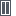
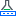

# Infrastructure Icons

The user interface icons display Veeam Backup & Replication infrastructure objects, jobs and their current state.

Jobs

The following icons represent the jobs configured in Veeam Backup & Replication.

| Icon | Description |
| --- | --- |
|  | Job |
|  | High priority job |
|  | Job in the disabled state |
|  | Job in the running state |

Job Nodes

The following icons represent the job nodes displayed in the inventory pane of the Home view.

| Icon | Description |
| --- | --- |
|  | Backup jobs |
|  | Replication jobs |
|  | Backup copy jobs |
|  | SureBackup jobs |
|  | Tape jobs |
|  | File copy jobs |
|  | VM copy jobs |
|  | Agent backup jobs / backup copy jobs |

Backups

The following icons represent the backups created with Veeam Backup & Replication.

| Icon | Description |
| --- | --- |
|  | Backup |
|  | Encrypted backup |
|  | Backup to tape |
|  | Incomplete backup |

Backup Nodes

The following icons represent the backup nodes displayed in the inventory pane of the Home view.

| Icon | Description |
| --- | --- |
|  | Backups on disk |
|  | Backup copies on disk |
|  | Imported backups on disk |
|  | Exported backups on disk |
|  | Orphaned backups on disks |
|  | Encrypted backups on disk |
|  | Backups in external repository |
|  | Encrypted backups in external repository |
|  | Backups in cloud repository |
|  | Orphaned backups in cloud repository |
|  | Backups on tape |
|  | Encrypted backups on tape |
|  | Backups in object storage |
|  | Backup copies in object storage |
|  | Encrypted backups in object storage |
|  | Imported backups in object storage |
|  | Orphaned backups in object storage |
|  | VeeamZIP backups in object storage |
|  | Backups in object storage with data archiving |
|  | Backups in capacity tier |
|  | Imported backups in capacity tier |
|  | Orphaned backups in capacity tier |
|  | VeeamZIP backups in capacity tier |
|  | Backups in archive tier |
|  | Imported backups in archive tier |
|  | Orphaned backups in archive tier |
|  | VeeamZIP backups in archive tier |

Restore Points

The following icons indicate the states of the restore points in backups of all types.

| Icon | Description |
| --- | --- |
|  | Full restore point |
|  | Incremental restore point |
|  | Reverse incremental restore point |
|  | Missing full restore point |
|  | Missing incremental restore point |
|  | Missing reverse incremental restore point |
|  | Infected restore point |

Scale-Out Backup Repository Restore Points

The following icons indicate the states of the restore points in the scale-out backup repository.

| Icon | Description |
| --- | --- |
|  | Full restore point; on performance tier only |
|  | Full restore point; on performance tier and offloaded to capacity tier |
|  | Full restore point; on capacity tier only |
|  | Full restore point; on capacity tier and partially downloaded to performance tier  (This can happen when download to the performance tier fails) |
|  | Incremental restore point; on performance tier only |
|  | Incremental restore point; on performance tier and offloaded to capacity tier |
|  | Incremental restore point; on capacity tier only |
|  | Incremental restore point; on capacity tier and partially downloaded to performance tier  (This can happen when download to the performance tier fails) |
|  | Rollback restore point; on performance tier only |
|  | Rollback restore point; on performance tier and offloaded to capacity tier |
|  | Rollback restore point; on capacity tier only |
|  | Rollback restore point; on capacity tier and partially downloaded to performance tier  (This can happen when download to the performance tier fails) |
|  | Rollback restore point; on archive tier only |

Replicas

The following icons represent the replicas configured in Veeam Backup & Replication and displayed in the inventory pane of the Home view.

| Icon | Description |
| --- | --- |
|  | Replicas in the active state |
|  | Replicas in the ready state |
|  | Failover plan |
|  | Cloud failover plan |

Microsoft Entra ID Backups

| Icon | Description |
| --- | --- |
|  | Microsoft Entra ID tenant / Microsoft Entra ID tenant backup |
|  | Microsoft Entra ID audit and sign-in log backup |
|  | Microsoft Entra ID tenant backup is corrupted |

VMware vSphere Virtual Infrastructure

The following icons represent the hypervisor objects of VMware vSphere workloads and servers added to the backup infrastructure.

| Icon | Description |
| --- | --- |
|  | vCenter |
|  | VM |
|  | Deleted VM |
|  | VM in the running state |
|  | VM in the paused state |
|  | VM in the disabled state |
|  | VM in the failback state |
|  | VM is corrupted |
|  | VM is not consistent |
|  | Infected VM |
|  | VM in the upgrade state |
|  | VM with the vSphere Fault Tolerance feature enabled |
|  | Cluster |
|  | Datacenter |
|  | Datastore |
|  | Failed datastore |
|  | ESXi host |
|  | Provider VDC |
|  | Resource pool |

Hyper-V Virtual Infrastructure

The following icons represent the hypervisor objects of Hyper-V workloads and servers added to the backup infrastructure.

| Icon | Description |
| --- | --- |
|  | Cluster |
|  | Corrupted cluster |
|  | Host |
|  | SCVMM |
|  | VM |
|  | VM in the paused state |
|  | VM in the running state |
|  | VM in the failback state |
|  | VM is corrupted |
|  | Infected VM |
|  | VM in the upgrade state |

VMware Cloud Director

The following icons represent the VMware Cloud Director objects added to Veeam Backup & Replication.

| Icon | Description |
| --- | --- |
|  | VMware Cloud Director infrastructure |
|  | Cloud Director organization |
|  | Cloud Director organization VDC |
|  | Cloud Director vApp |
|  | Cloud Director vApp in the running state |
|  | Cloud Director vApp is not consistent |
|  | Cloud Director vApp in the mounting state |
|  | Cloud Director vApp in the failback state |
|  | Cloud Director vApp is infected |
|  | Cloud Director vApp is corrupted |
|  | Cloud Director vApp has an error |
|  | Cloud Director vApp template |

Physical Infrastructure

The following icons represent the physical infrastructure objects added to Veeam Backup & Replication.

| Icon | Description |
| --- | --- |
|  | Protection group |
|  | Protection group in the disabled state |
|  | Protection group is outdated |
|  | Protection group is unavailable |
|  | Unmanaged protection group |
|  | Veeam Agent computer |
|  | Veeam Agent computer is corrupted |
|  | Encrypted Veeam Agent computer |
|  | Infected Veeam Agent computer |
|  | Microsoft Windows-based Veeam Agent computer |
|  | Microsoft Windows-based Veeam Agent computer is corrupted |
|  | Linux-based Veeam Agent computer |
|  | Linux-based Veeam Agent computer is corrupted |
|  | macOS-based Veeam Agent computer |
|  | macOS-based Veeam Agent computer is corrupted |
|  | IBM AIX-based Veeam Agent computer |
|  | IBM AIX-based Veeam Agent computer is corrupted |
|  | Oracle Solaris-based Veeam Agent computer |
|  | Oracle Solaris-based Veeam Agent computer is corrupted |

Unstructured Data

The following icons represent the unstructured data sources added to Veeam Backup & Replication.

| Icon | Description |
| --- | --- |
|  | File server |
|  | NAS filer |
|  | File share |
|  | SMB file server |
|  | NFS file server |
|  | Amazon S3 object storage |
|  | Microsoft Azure Blob storage |
|  | Microsoft Azure Data Lake storage |
|  | S3 compatible object storage |

Backup Proxies

The following icons represent the backup proxies added to Veeam Backup & Replication.

| Icon | Description |
| --- | --- |
|  | VMware / Hyper-V backup proxy |
|  | VMware / Hyper-V backup proxy is disabled |
|  | General-purpose backup proxy (for file shares) |
|  | Backup proxy is busy |
|  | Backup proxy is disabled |
|  | Backup proxy is outdated |
|  | Backup proxy is unavailable |
|  | CDP proxy |
|  | CDP proxy is disabled |
|  | CDP proxy is outdated |
|  | CDP proxy is unavailable |

Backup Repositories and Scale-Out Backup Repositories

The following icons represent the backup repositories and scale-out backup repositories added to Veeam Backup & Replication.

| Icon | Description |
| --- | --- |
|  | Backup repositories |
|  | External repositories |
|  | Cloud repositories |
|  | Scale-out backup repository |
|  | Repository is busy |
|  | Repository is full |
|  | Repository is outdated |
|  | Repository is unavailable |
|  | Repository in the maintenance mode |
|  | Repository in the sealed mode |
|  | Windows server repository |
|  | Linux server repository |
|  | Hardened repository |
|  | SMB share repository |
|  | NFS share repository |
|  | Veeam Data Cloud Vault |
|  | Veeam Data Cloud Vault in the maintenance mode |
|  | Veeam Data Cloud Vault in the sealed mode |
|  | S3 compatible repository |
|  | S3 compatible repository in the maintenance mode |
|  | S3 compatible repository in the sealed mode |
|  | S3 compatible repository with data archiving repository |
|  | S3 compatible repository with data archiving repository in the maintenance mode |
|  | S3 compatible repository with data archiving repository in the sealed mode |
|  | Amazon S3 repository |
|  | Amazon S3 repository in the maintenance mode |
|  | Amazon S3 repository in the sealed mode |
|  | Amazon Glacier repository |
|  | Amazon Glacier repository in the maintenance mode |
|  | Amazon Glacier repository in the sealed mode |
|  | S3-integrated repository (using SOSAPI functionality) |
|  | S3-integrated repository in the maintenance mode |
|  | S3-integrated repository in the sealed mode |
|  | AWS Snowball Edge Storage repository |
|  | AWS Snowball Edge Storage repository in the maintenance mode |
|  | AWS Snowball Edge Storage repository in the sealed mode |
|  | IBM Cloud repository |
|  | IBM Cloud repository in the maintenance mode |
|  | IBM Cloud repository in the sealed mode |
|  | Google Cloud Storage repository |
|  | Google Cloud Storage repository in the maintenance mode |
|  | Google Cloud Storage repository in the sealed mode |
|  | Microsoft Azure Blob Storage repository |
|  | Microsoft Azure Blob Storage repository in the maintenance mode |
|  | Microsoft Azure Blob Storage repository in the sealed mode |
|  | Microsoft Azure Archive Storage repository |
|  | Microsoft Azure Archive Storage repository in the maintenance mode |
|  | Microsoft Azure Archive Storage repository in the sealed mode |
|  | Microsoft Azure Data Box Storage repository |
|  | Microsoft Azure Data Box Storage repository in the maintenance mode |
|  | Microsoft Azure Data Box Storage repository in the sealed mode |
|  | 11:11 Cloud Object Storage repository |
|  | 11:11 Cloud Object Storage repository in the maintenance mode |
|  | 11:11 Cloud Object Storage repository in the sealed mode |
|  | Wasabi repository |
|  | Wasabi repository in the maintenance mode |
|  | Wasabi repository in the sealed mode |
|  | Infinidat InfiniGuard repository |
|  | Infinidat InfiniGuard repository in the maintenance mode |
|  | Infinidat InfiniGuard repository in the sealed mode |
|  | Quantum DXi repository |
|  | Quantum DXi repository in the maintenance mode |
|  | Quantum DXi repository in the sealed mode |
|  | ExaGrid repository |
|  | ExaGrid repository in the maintenance mode |
|  | ExaGrid repository in the sealed mode |
|  | Fujitsu ETERNUS CS800 repository |
|  | Fujitsu ETERNUS CS800 repository in the maintenance mode |
|  | Fujitsu ETERNUS CS800 repository in the sealed mode |
|  | HPE StoreOnce repository |
|  | HPE StoreOnce repository in the maintenance mode |
|  | HPE StoreOnce repository in the sealed mode |
|  | Dell Data Domain repository |
|  | Dell Data Domain repository in the maintenance mode |
|  | Dell Data Domain repository in the sealed mode |

External Repositories

The following icons represent the external repositories added to Veeam Backup & Replication.

| Icon | Description |
| --- | --- |
|  | Amazon S3 external repository |
|  | Microsoft Azure Blob Storage external repository |
|  | Google Cloud Storage external repository |
|  | External repository is unavailable |

WAN Accelerators

The following icons represent the WAN accelerators added to Veeam Backup & Replication.

| Icon | Description |
| --- | --- |
|  | WAN accelerator |
|  | WAN accelerator is busy |
|  | WAN accelerator has an error |
|  | WAN accelerator is outdated |

SureBackup

The following icons represent the SureBackup objects.

| Icon | Description |
| --- | --- |
|  | Application group |
|  | Virtual lab |

Managed Servers

For more information about the icons that represent the hypervisor objects of VMware vSphere workloads and servers, see the [VMware vSphere Virtual Infrastructure](#vi_vsphere) section.

For more information about the icons that represent the hypervisor objects of Hyper-V workloads and servers, see the [Hyper-V Virtual Infrastructure](#vi_hyperv) section.

| Icon | Description |
| --- | --- |
|  | Microsoft Windows server |
|  | Linux host |
|  | Server is unavailable |
|  | Server is outdated |
|  | Veeam Software Appliance |
|  | Veeam Software Appliance is outdated |
|  | Domain |

Tape Infrastructure

For more information about the icons that represent the tape infrastructure components, see [Tape Infrastructure Icons](tape_indicators.md).

