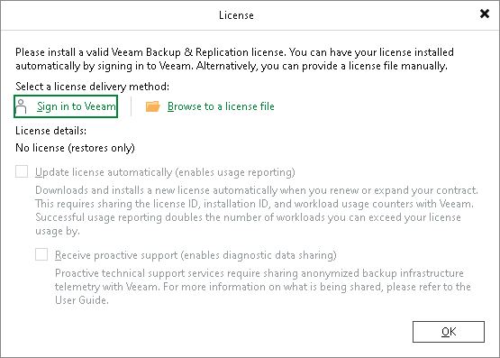
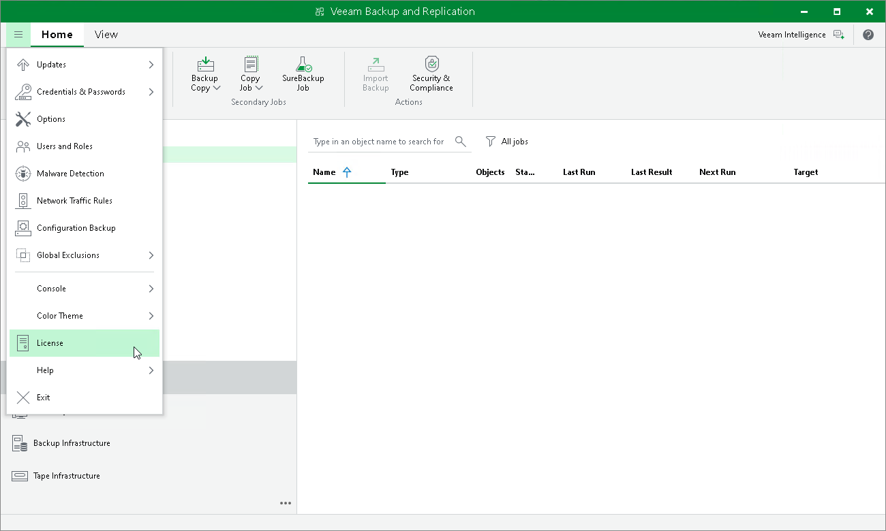
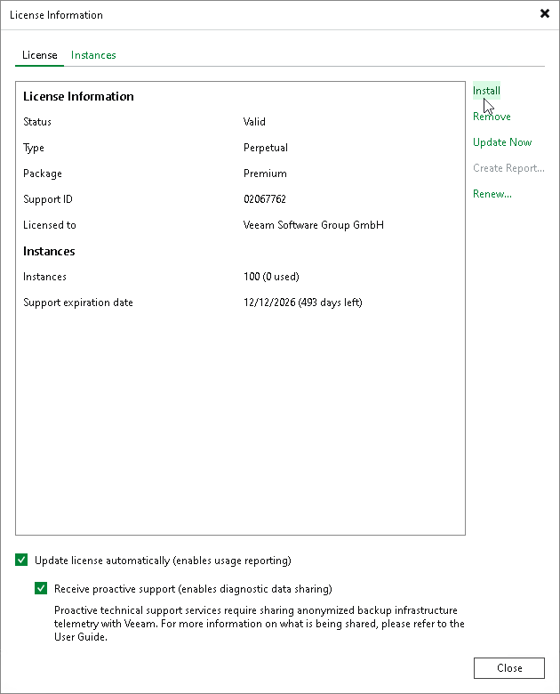

# Installing License Using Console

When you access the remote Veeam Backup & Replication console for the first time, you are asked to install a valid Veeam Backup & Replication license. If you do not specify a path to the license file, Veeam Backup & Replication will run in the Veeam Backup & Replication Community (free) Edition. Veeam Software Appliance 13.0.0 (build 13.0.0.4967) operating in the Veeam Backup & Replication Community Edition supports only [data recovery](data_recovery_all.md) features. For more information, see [Veeam Backup & Replication Community Edition](https://www.veeam.com/virtual-machine-backup-solution-free.html).

Initial License Installation

To install a Veeam Backup & Replication license when launching the Veeam Backup & Replication console for the first time:

1. In the License window, select a license delivery method:

* Sign in to Veeam — use this option to log in to your veeam account to select a license from the list of available licenses.
* Browse to a license file  — use this option if you have your license file (LIC) downloaded.

1. Confirm the use of the selected license.

License Update

You can change the license later:

1. From the main menu, select License.

1. In the License Information window, click Install.

1. Browse to the LIC file and click Open.

Licenses in Veeam Backup Enterprise Manager

If backup servers are connected to Veeam Backup Enterprise Manager, Veeam Backup Enterprise Manager collects information about all licenses installed on backup servers. When Veeam Backup Enterprise Manager replicates databases from backup servers, it also synchronizes license data: checks if the license installed on the backup server coincides with the license installed on the Veeam Backup Enterprise Manager server. If the licenses do not coincide, the license on the backup server is automatically replaced with the license installed on the Veeam Backup Enterprise Manager server.

For information on Veeam Backup Enterprise Manager license, see the [Licensing](https://helpcenter.veeam.com/docs/vbr/em/managing_licenses.html?ver=13) section of the Veeam Backup Enterprise Manager Guide.

