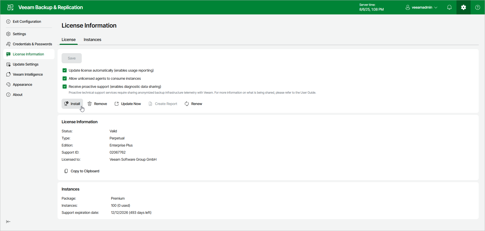

# Installing License Using Web UI

When you access the Veeam Backup & Replication web UI for the first time, you are asked to specify a path to the license file. If you do not specify a path to the license file, you are not allowed to access the web UI and will be shown the prompt to install a license until you do it.

Initial License Installation

To install a Veeam Backup & Replication license:

1. In the displayed Veeam Backup & Replication window, click Install.

1. Browse to the LIC file and click Open.

License Update

You can change the license later:

1. Click the gear icon in the top bar and select License Information.
2. In the License Information window, click Install.

1. Browse to the LIC file and click Open.

Licenses in Veeam Backup Enterprise Manager

If backup servers are connected to Veeam Backup Enterprise Manager, Veeam Backup Enterprise Manager collects information about all licenses installed on backup servers. When Veeam Backup Enterprise Manager replicates databases from backup servers, it also synchronizes license data: checks if the license installed on the backup server coincides with the license installed on the Veeam Backup Enterprise Manager server. If the licenses do not coincide, the license on the backup server is automatically replaced with the license installed on the Veeam Backup Enterprise Manager server.

For information on Veeam Backup Enterprise Manager license, see the [Licensing](https://helpcenter.veeam.com/docs/vbr/em/managing_licenses.html?ver=13) section of the Veeam Backup Enterprise Manager Guide.

