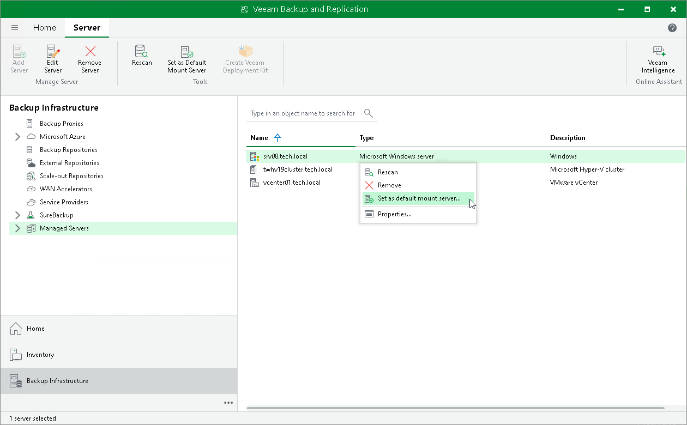

# Step 1. Launch Install Mount Service Wizard

To manually launch the Install Mount Service wizard:

1. Open the Backup Infrastructure view.
2. In the inventory pane, select Managed servers.
3. In the working area, right-click the server or host and select Set as default mount server.

