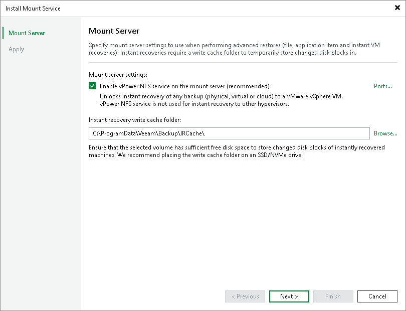

# Step 2. Specify Mount Server Settings

In this article

At the Mount Server step of the wizard, specify settings for the mount server that you plan to use by default for restores that work with guest OS files and application items.

To configure the mount server settings:

1. To make the backup repository accessible by the [Veeam vPower NFS Service](vpower_nfs_service.md), select the Enable vPower NFS service on the mount server check box. Veeam Backup & Replication will enable the vPower NFS Service on your selected mount server.

|  |
| --- |
| Important |
| Do not enable Microsoft Windows NFS services on the machine where you install the Veeam vPower NFS Service. If Microsoft NFS services and Veeam vPower NFS Service are enabled on the same machine, both services may fail to work correctly. |

1. To customize network ports used by the vPower NFS Service, click Ports. For information on ports used by default, see [Ports](used_ports.md).
2. In the Instant recovery write cache folder field, specify a folder that will be used for writing cache during mount operations.

Page updated 8/22/2025

Page content applies to build 13.0.1.1071
