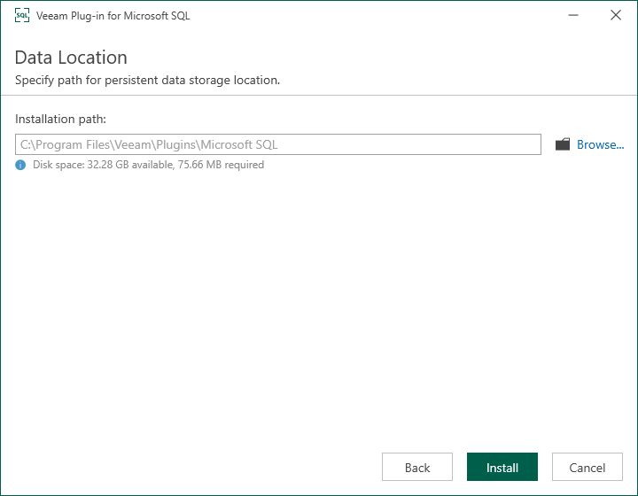

# Installing Veeam Plug-In

Veeam Plug-In for Microsoft SQL Server is an additional component of Veeam Backup & Replication. The installation package of the plug-in is included in the Veeam Backup & Replication installation ISO file and available for download from [veeam.com](https://www.veeam.com/products/data-platform-trial-download.html?tab=application-plugins).

To install Veeam Plug-In for Microsoft SQL Server, perform the following steps:

1. Export installation packages to the machine with a database that you plan to protect. You can do it in the following ways:

Using the Veeam Backup & Replication installation image

1. Mount the Veeam Backup & Replication installation image.

You can download the latest version of the Veeam Backup & Replication installation image from [this Veeam webpage](https://www.veeam.com/products/data-platform-trial-download.html).

1. In the installation disk folder, navigate to the \Plugins\Microsoft SQL\x64\ folder and find the VeeamPluginforMSSQL.exe file.

1. Upload the VeeamPluginforMSSQL.exe file to Microsoft SQL Server.

Using veeam.com

1. Download the setup archive for Veeam Plug-In for Microsoft SQL Server from [this Veeam webpage](https://www.veeam.com/products/data-platform-trial-download.html?tab=application-plugins).
2. In the setup archive, find the VeeamPluginforMSSQL.exe file.
3. Upload the VeeamPluginforMSSQL.exe file to Microsoft SQL Server.

1. Install Veeam Plug-In. To do this, run the following commands:

1. Open the setup archive.
2. To launch the installation wizard, run the VeeamPluginforMSSQL.exe file.
3. At the welcome screen of the installation wizard, click Next.

1. At the License Agreement step of the wizard, follow the links to view license agreements and click I Accept.

1. At the Data Location step of the wizard, specify the installation path for Veeam Plug-In and click Install.

By default, the installation wizard installs the product to the %PROGRAMFILES%\Veeam\Plugins\Microsoft SQL folder.

1. Wait for the installation process to complete and click Finish to exit the wizard.

Once Veeam Plug-In is installed, you can configure the plug-in settings. For details, see [Configuring Veeam Plug-In for Microsoft SQL Server](configuring_mssql_plugin.md).

