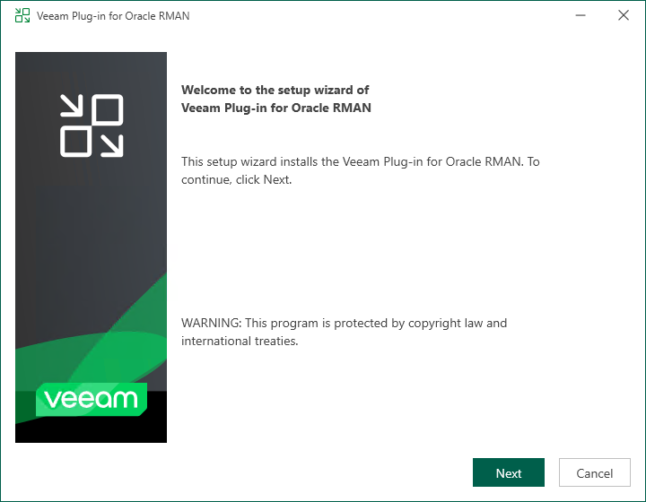
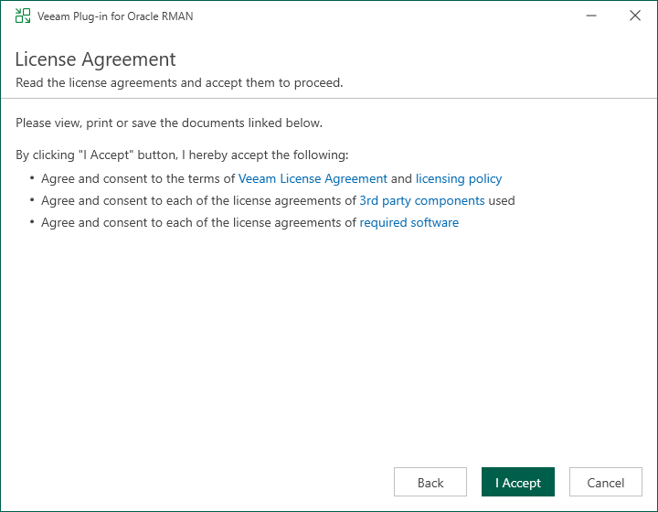

# Installing Plug-In on Microsoft Windows

In this article

Veeam Plug-In for Oracle RMAN is an additional component of Veeam Backup & Replication. The installation package of the plug-in is included in the Veeam Backup & Replication installation ISO file and available for download from [veeam.com](https://www.veeam.com/products/data-platform-trial-download.html?tab=application-plugins).

You can install Veeam Plug-In for Oracle RMAN on Windows machines using a wizard or in an unattended mode:

* [Installing Veeam Plug-In using an installation wizard](#win)
* [Installing Veeam Plug-In in an unattended mode](#unat)

|  |
| --- |
| Note |
| When you launch the installation file, it also installs Microsoft .NET Framework 4.5.2 if it does not detect this component on the machine during the product installation. In some cases, installation of .NET Framework requires a reboot of the machine. This can happen, for example, if you have an earlier version of .NET Framework installed on the machine and during the installation process it is used by third-party software. |

Installing Plug-In Using an Installation Wizard

To install Veeam Plug-In for Oracle RMAN on a Windows machine, perform the following steps:

1. Export installation packages to the machine with a database that you plan to protect. You can do it in the following ways:

Using the Veeam Backup & Replication installation image

1. Mount the Veeam Backup & Replication installation image.

You can download the latest version of the Veeam Backup & Replication installation image from [this Veeam webpage](https://www.veeam.com/products/data-platform-trial-download.html).

1. In the installation disk folder, go to \Plugins\Oracle RMAN\Windows.
2. Upload the VeeamPluginforOracleRMAN.exe file to Microsoft SQL Server, then run the uploaded file to launch the installation wizard.

Using veeam.com

1. Download the setup archive for Veeam Plug-In for Oracle RMAN from [this Veeam webpage](https://www.veeam.com/products/data-platform-trial-download.html?tab=application-plugins).
2. Open the setup archive, in the \VeeamPluginforOracleRMAN-13.0.1.180\RMAN folder, find the VeeamPluginforOracleRMAN.exe file.
3. Upload the VeeamPluginforOracleRMAN.exe file to Microsoft SQL Server, then run the uploaded file to launch the installation wizard.

1. Install Veeam Plug-In. To do this, run the following commands:

1. At the welcome screen of the installation wizard, click Next.

1. At the License Agreement step of the wizard, accept the terms of license agreements and click I Accept.

1. At the Data Location step of the wizard, specify the installation path for Veeam Plug-In and click Install.

1. Wait for the installation process to complete and click Finish to exit the wizard.

Once Veeam Plug-In is installed, you can configure the plug-in settings. For details, see [Configuring Plug-In on Microsoft Windows](configuring_rman_plugin_win.md).

Installing Plug-In in Unattended Mode

To install Veeam Plug-In for Oracle RMAN on a Windows machine, do the following:

1. Export installation packages to the machine with a database that you plan to protect. You can do it in the following ways:

Using the Veeam Backup & Replication installation image

1. Mount the Veeam Backup & Replication installation image.

You can download the latest version of the Veeam Backup & Replication installation image from [this Veeam webpage](https://www.veeam.com/products/data-platform-trial-download.html).

1. In the installation image folder, go to \Plugins\Oracle RMAN\Windows.
2. Upload the VeeamPluginforOracleRMAN.exe file to Microsoft SQL Server.

Using veeam.com

1. Download the setup archive for Veeam Plug-In for Oracle RMAN from [this Veeam webpage](https://www.veeam.com/products/data-platform-trial-download.html?tab=application-plugins).
2. Open the setup archive, in the \VeeamPluginforOracleRMAN-13.0.1.180-1\Windows folder, find the VeeamPluginforOracleRMAN.exe file.
3. Upload the VeeamPluginforOracleRMAN.exe file to Microsoft SQL Server.

1. Install Veeam Plug-In for Oracle RMAN on a Windows machine in the unattended mode using the command line. Go to folder where the VeeamPluginforOracleRMAN.exe file resides and run the following command:

|  |
| --- |
| <path\_to\_exe>\VeeamPluginforOracleRMAN.exe /silent /accepteula /acceptthirdpartylicenses /acceptlicensingpolicy /acceptrequiredsoftware |

where <path\_to\_exe> is a path to the Veeam Plug-In for Oracle RMAN installation file.

| Parameter | Description |
| --- | --- |
| /silent | Enables the silent mode. |
| /accepteula | Accepts [EULA](https://www.veeam.com/eula.html) terms. |
| /acceptthirdpartylicenses | Accepts terms of third-party licenses. |

Veeam Plug-In for Oracle RMAN uses the following codes to report about the installation results:

* 1000 — Veeam Plug-In for Oracle RMAN has been successfully installed.
* 1001 — prerequisite components required for Veeam Plug-In for Oracle RMAN have been installed on the machine. Veeam Plug-In for Oracle RMAN has not been installed. The machine needs to be rebooted.
* 1002 — Veeam Plug-In for Oracle RMAN installation has failed.
* 1101 — Veeam Plug-In for Oracle RMAN has been installed. The machine needs to be rebooted.

Once Veeam Plug-In is installed, you can configure the plug-in settings. For details, see [Configuring Plug-In on Microsoft Windows](configuring_rman_plugin_win.md).

Page updated 1/6/2026

Page content applies to build 13.0.1.1071
