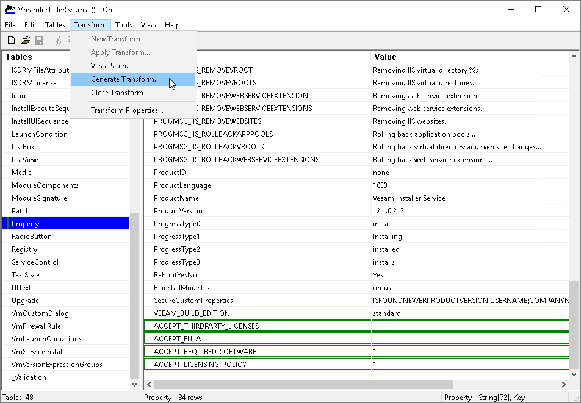
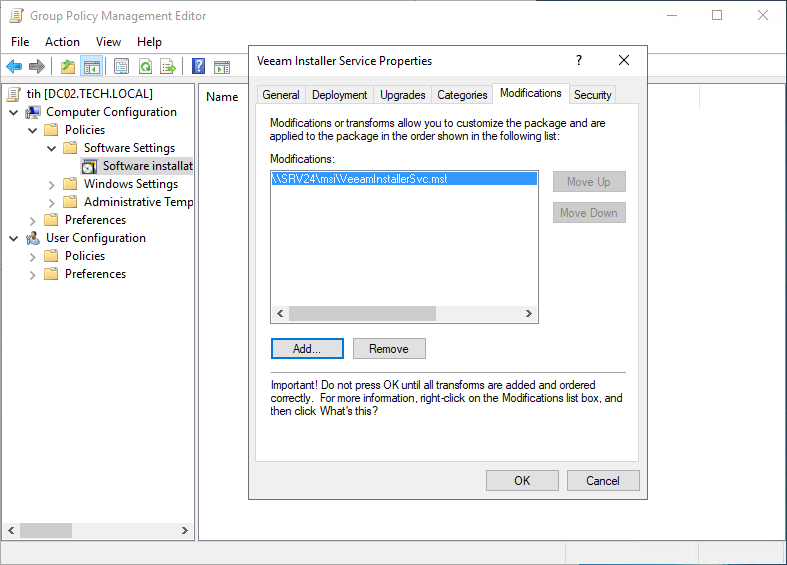

# Installing Veeam Installer Service with GPO

In this article

This topic describes how you can deploy the Veeam Installer service setup file to remote computers using GPO. You must create an MST file with custom configuration parameters and use this MST file to deploy the service on remote computers.

Step 1. Unpack Service Setup File

Unpack the content of the service setup file:

1. Obtain the necessary version of the service setup file.

The service setup files reside in the C:\Program Files\Veeam\Backup and Replication\Backup\Packages folder on the machine where Veeam Backup & Replication is installed.

1. Perform installation of the service in the administrator mode to unpack the content of the setup file:

1. In the command prompt, run a command to start the wizard.

For example, for the VeeamInstaller service, the command is:

msiexec /a <...>/VeeamInstallerSvc.msi

1. At the Network Location step of the wizard, specify a directory to which setup files must be unpacked.
2. Click Install.

1. Check the output directory and make sure it includes the .msi file and the Windows folder.

1. Copy the unpacked files to a network share.

The network share must be accessible from all machines on which you want to deploy the service. Make sure you set at least Read permissions on the files.

Step 2. Create MST Configuration File

Create an MST configuration file:

1. In the output directory, open the service setup file and edit it with Orca.

For details on Orca, see [Windows Dev Center](https://msdn.microsoft.com/en-us/library/windows/desktop/aa370557%28v%3Dvs.85%29.aspx).

1. In the menu, choose Transform > New Transform.
2. In the Tables pane, click Property.
3. Add the following properties to the table and set their values to 1 to accept the terms and proceed with installation:

* ACCEPT\_THIRDPARTY\_LICENSES — specifies if you want to accept the terms of the license agreement for the 3rd party components.

* ACCEPT\_REQUIRED\_SOFTWARE — specifies if you want to accept all required software license agreements.
* ACCEPT\_LICENSING\_POLICY — specifies if you want to accept the Veeam licensing policy.
* ACCEPT\_EULA — specifies if you want to accept the terms of the Veeam license agreement.

1. In the menu, choose Transform > Generate Transform.

1. Save the MST file with configuration details.
2. Close Orca.
3. Copy the MST to a network share.

The network share must be accessible from all machines on which you want to deploy the service. Make sure you set at least Read permissions on the files.

Step 3. Create Group Policies

Create a Group Policy that will install and configure the service on the machines:

1. Log on to a domain controller.
2. Open the Group Policy Management Console.
3. Right-click the organizational unit which includes computers on which the service must be deployed, and choose to create a new Group Policy Object.
4. Right-click the Group Policy Object and choose Edit.
5. In the left pane of the Group Policy Management Editor, expand Computer Configuration > Policies > Software Settings.
6. Right-click Software Installation and select New > Package.
7. In the Open window, point to the service setup file located on the network share.
8. In the Deploy Software window, choose the Advanced deployment method.
9. Open the Modifications tab, click Add and choose the MST file located on the network share.
10. Click OK.
11. In the left pane of the Group Policy Management Editor, expand Computer Configuration > Policies > Administrative Templates > System > Logon.
12. Right-click the Always wait for the network at computer startup and logon policy setting and choose Edit.
13. In the policy setting window, select Enabled and click OK.
14. Close the Group Policy Management Editor.

Step 4. Apply Group Policies to Client Computers

Apply the created Group Policy to client computers.

Page updated 6/27/2025

Page content applies to build 13.0.1.1071
