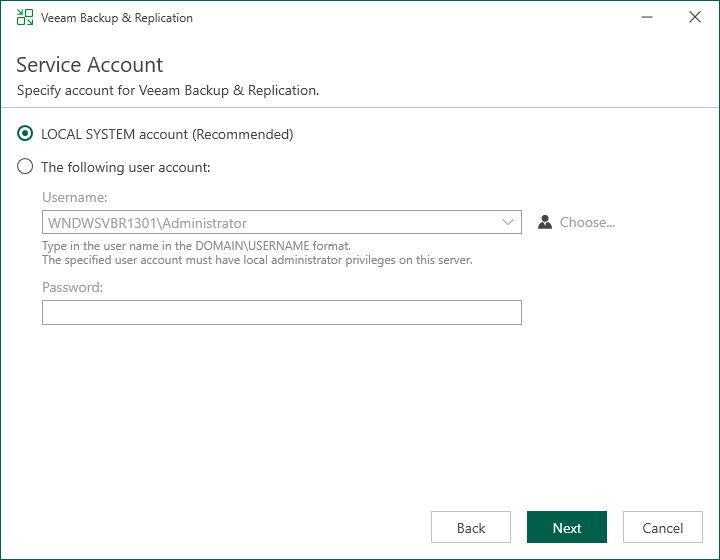

# Step 7. Specify Service Account Settings

The Service Account step of the wizard is available if you have selected to configure installation settings manually.

You can select an account under which you want to run the Veeam Backup Service:

* LOCAL SYSTEM account (recommended, used by default)
* Custom user account

The user name of the custom account must be specified in the DOMAIN\USERNAME format and have the following rights and permissions:

* The account must be a member of the Administrators group on the machine where Veeam Backup & Replication is installed.
* The account must have db\_owner rights for the configuration database.

Veeam Backup & Replication automatically grants the Log on as service right to the specified user account.

|  |
| --- |
| Note |
| You cannot use a gMSA for running the Veeam Backup Service. |

