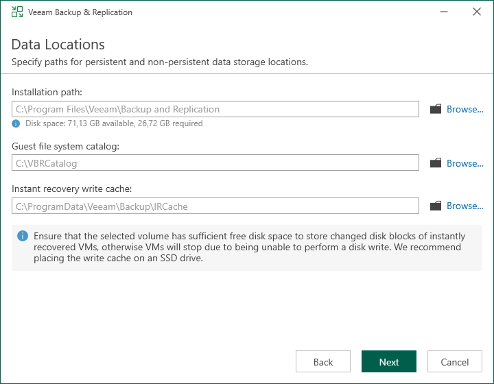

# Step 9. Specify Data Locations

In this article

The Data Locations step is available if you have selected to configure installation settings manually and to install a new instance of the database server.

At this step of the wizard, you can specify the installation folder and where the write cache and indexing data must be stored.

1. To change the default installation folder, click Browse next to the Installation path field.

By default, the setup wizard uses the following installation folder: C:\Program Files\Veeam\Backup and Replication.

Veeam Backup & Replication setup wizard calculates the space available on the selected disk and displays this information for your convenience.

1. To change the path to the folder where index files will be stored, click Browse next to the Guest file system catalog field.

By default, the setup wizard creates the VBRCatalog folder on a volume with the maximum amount of free space, for example: C:\VBRCatalog.

1. [For VMware environments] The instant recovery cache folder stores the write cache for machines that are started from backups during recovery verification or restore operations. To change the path to the IR cache folder, click Browse next to the Instant recovery write cache field. The minimum required free disk space for the IR cache folder is 10 GB. However, at least 100 GB is recommended for production environments, and more may be needed depending on the number and write activity of VMs being published with Instant Recovery.

By default, the setup wizard creates the IR cache folder on a volume with the maximum amount of free space, for example: C:\ProgramData\Veeam\Backup\IRCache.

You do not need to configure this data location for Microsoft Hyper-V environments.

Page updated 10/27/2025

Page content applies to build 13.0.1.1071
