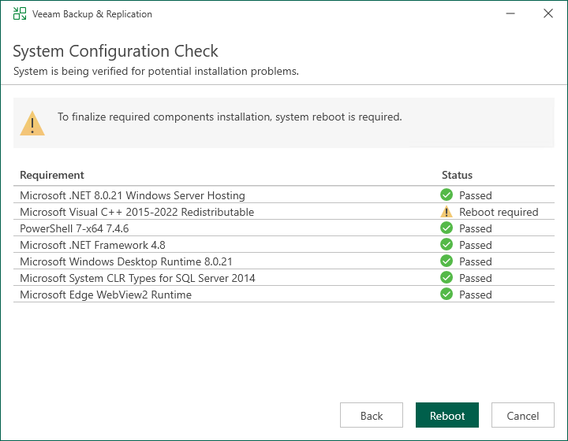

# Step 5. Install Missing Software

In this article

At the System Configuration Check step of the wizard, the setup wizard checks if the required software is installed on the machine. If some of the required components are missing, the setup will try to install them automatically. After the components are successfully installed, reboot is required. To reboot the machine, click Reboot.

If the setup wizard cannot install some of the required software components automatically, install them manually and click Retry.

|  |
| --- |
| Note |
| If all required software is already installed on the machine, the System Configuration Check step will be skipped. For more information on the necessary software, see [System Requirements](system_requirements.md#backup_server). |

Page updated 10/21/2025

Page content applies to build 13.0.1.1071
