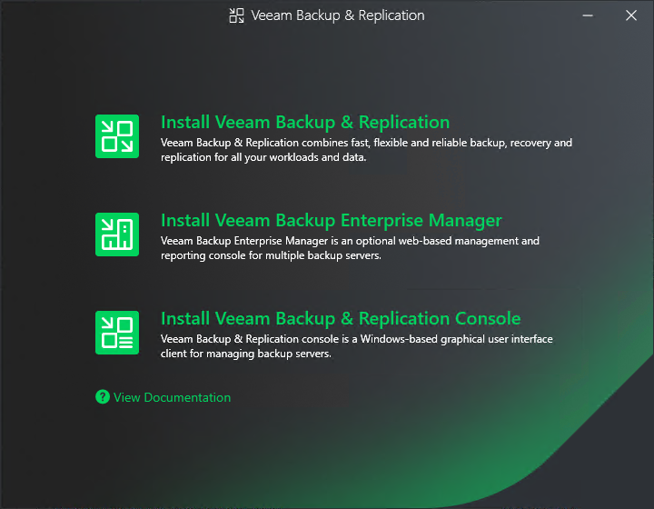

# Step 2. Select Component

At the Select Veeam Backup & Replication Component step of the wizard, select Install Veeam Backup & Replication.

To open Veeam Help Center from the setup wizard, click View Documentation.

