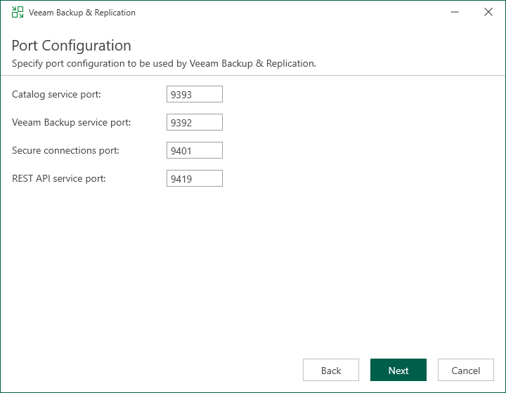

# Step 10. Specify Service Ports

In this article

The Port Configuration step of the wizard is available if you have selected to configure installation settings manually.

At this step of the wizard, you can customize port number values that will be used for communication between backup infrastructure components. For more information about Veeam Backup & Replication ports, see [Ports](used_ports.md).

* Catalog service port. This port is used by the Veeam Guest Catalog Service to replicate catalog data from backup servers to Veeam Backup Enterprise Manager. By default, port 9393 is used.
* Veeam Backup service port. This port is used by Veeam Backup Enterprise Manager to collect data from backup servers. In addition to it, the Veeam Backup & Replication console uses this service port to connect to the backup server. By default, port 9392 is used.
* Secure connections port. This port is used by the mount server to communicate with the backup server. By default, port 9401 is used.
* REST API service port. This port is used to communicate with the Veeam Backup & Replication REST API. By default, port 9419 is used.

Page updated 10/22/2025

Page content applies to build 13.0.1.1071
