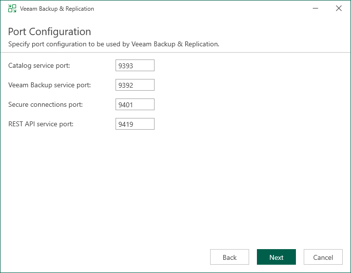

# Step 10. Specify Service Ports

The Port Configuration step of the wizard is available if you have selected to configure installation settings manually.

At this step of the wizard, you can customize port number values that will be used for communication between backup infrastructure components. For more information about Veeam Backup & Replication ports, see [Ports](used_ports.md).

* Primary service port. This port is used by the reverse proxy to consolidate all service traffic. The reverse proxy will securely route incoming connections to Veeam components. By default, port 443 is used.
* RESTful API service port. This port is used to communicate with the Veeam Backup & Replication REST API. By default, port 9419 is used.

Page updated 2026-07-20

