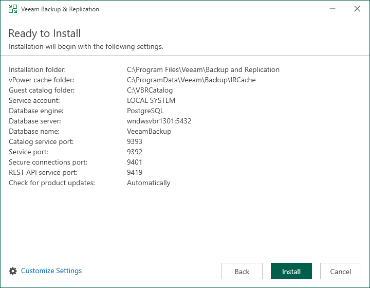

# Step 6. Review Default Installation Settings

At the Ready to Install step of the wizard, you can select to install Veeam Backup & Replication with default installation settings or specify custom installation settings.

* To use the default installation settings, click Install.
* To use custom installation settings, click Customize Settings. The setup wizard will include additional steps that will let you configure installation settings.

The following table lists the default installation settings.

| Setting | Default Value | Description |
| --- | --- | --- |
| Installation folder | C:\Program Files\Veeam\Backup and Replication\ | Folder where Veeam Backup & Replication will be installed. |
| vPower cache folder | C:\ProgramData\Veeam\Backup\IRCache\ | The IRCache folder on a volume with the maximum amount of free space. The IR cache folder stores the write cache for machines that are started from backups during recovery verification or restore operations. The minimum required free disk space for the IRCache folder is 10 GB. However, at least 100 GB is recommended for production environments, and more may be needed depending on the number and write activity of VMs being published with Instant Recovery. |
| Guest catalog folder | C:\VBRCatalog\ | The VBRCatalog folder on a volume with the maximum amount of free space.  The guest catalog folder stores indexing data for VM guest OS files. Indexing data is required for browsing and searching for VM guest OS files inside backups and performing 1-click restore. |
| Service account | LOCAL SYSTEM | Account under which the Veeam Backup Service runs. |
| Database engine | PostgreSQL | The setup wizard installs PostgreSQL as a database engine locally on the Veeam Backup & Replication server. |
| SQL server | <host\_name>:5432 | The local host name and port number to be used by SQL server. |
| Database name | VeeamBackup | The setup deploys the Veeam Backup & Replication configuration database on the locally installed instance of PostgreSQL. |
| Catalog service port | 9393 | The catalog service port is used by the Veeam Guest Catalog Service to replicate catalog data from backup servers to Veeam Backup Enterprise Manager. |
| Service port | 9392 | The service port is used by Veeam Backup Enterprise Manager to collect data from backup servers. In addition to it, the Veeam Backup & Replication console uses this service port to connect to the backup server. |
| Secure connections port | 9401 | The secure connections port is used by the mount server to communicate with the backup server. |
| REST API service port | 9419 | This service port is used to access the Veeam Backup & Replication REST API. |
| Check for updates | Automatically | Veeam Backup & Replication will check for product updates weekly. When a new product build is published on the Veeam update server, a notification is displayed in the Windows Action Center. |

The following Veeam services and components are also deployed when installing Veeam Backup & Replication. They have predefined installation locations that cannot be changed during the Veeam Backup & Replication installation:

| Veeam Component | Default Installation Path |
| --- | --- |
| AWS Plug-In for Veeam Backup & Replication | %ProgramFiles%\Veeam\Plugins\AWS\ |
| Veeam Plug-in for Google Cloud | %ProgramFiles%\Veeam\Plugins\GCP\ |
| Veeam Kasten Plug-In for Veeam Backup & Replication | %ProgramFiles%\Veeam\Plugins\Kasten\ |
| Microsoft Azure Plug-In for Veeam Backup & Replication | %ProgramFiles%\Veeam\Plugins\Microsoft Azure\ |
| Veeam Plug-In for Nutanix AHV | %ProgramFiles%\Veeam\Plugins\Nutanix AHV\ |
| oVirt KVM Plug-In for Veeam Backup & Replication | %ProgramFiles%\Veeam\Plugins\RHV\ |
| Veeam Plug-In for Proxmox Virtual Environment | %ProgramFiles%\Veeam\Plugins\PVE\ |
| Veeam Agent for Linux Redistributable | %ProgramData%\Veeam\Agents\ |
| Veeam Agent for Mac Redistributable | %ProgramData%\Veeam\Agents\ |
| Veeam Agent for Microsoft Windows Redistributable | %ProgramData%\Veeam\Agents\ |
| Veeam Agent for Unix Redistributable | %ProgramData%\Veeam\Agents\ |
| Veeam Backup Transport | %ProgramFiles(x86)%\Veeam\Backup Transport\ |
| Veeam Backup vPowerNFS | %ProgramFiles(x86)%\Veeam\vPowerNFS\ |
| Veeam Backup VSS Integration | %ProgramFiles%\Veeam\Backup File System VSS Integration\ |
| Veeam Distribution Service | %ProgramFiles%\Veeam\Veeam Distribution Service\ |
| Veeam Installer Service | %WinDir%\Veeam\Backup\ |
| Veeam Mount Server | %ProgramFiles%\Common Files\Veeam\Backup and Replication\Mount Service\ |
| Veeam Plug-Ins for Enterprise Applications Redistributable | %ProgramData%\Veeam\Plugins\ |
| VMware VDDK | %ProgramFiles(x86)%\Veeam\Backup Transport\ |

For more information, see [Veeam Backup & Replication Services](services_and_components.md).

