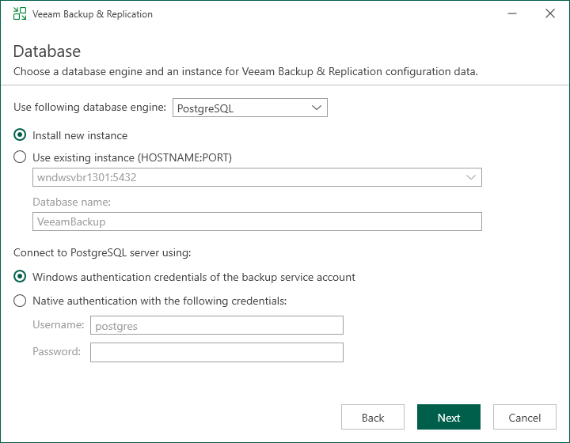
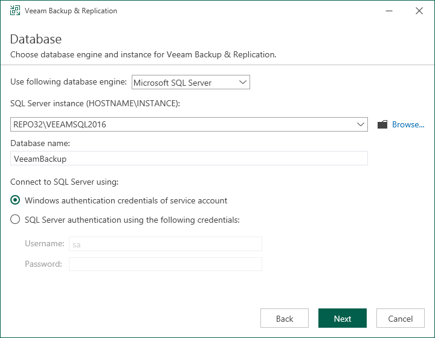
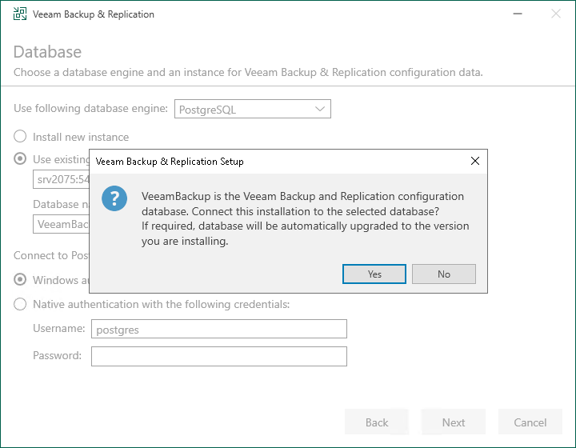

# Step 8. Specify Database Engine and Instance

In this article

The Database step of the wizard is available if you have selected to configure installation settings manually.

At this step of the wizard, you can choose a database engine (PostgreSQL or Microsoft SQL Server) for the Veeam Backup & Replication configuration database, specify a new or existing instance where you want to deploy the configuration database, and specify the authentication mode.

|  |
| --- |
| Note |
| Consider limitations and considerations in [Before You Begin](installation_byb.md). |

1. Select one of the following database engines that you want to use for the configuration database:

* PostgreSQL
* Microsoft SQL Server

1. Specify instance settings:

* [For PostgreSQL] You can use an already installed PostgreSQL instance or install a new one.

* To install a new PostgreSQL instance, select the Install new instance option. The setup will install PostgreSQL on the Veeam Backup & Replication server and create a database with the VeeamBackup name.
* To use an already installed PostgreSQL instance, select the Use existing instance option. Enter the instance name in the HOSTNAME:PORT format. In the Database name field, specify a name for the Veeam Backup & Replication configuration database.

|  |
| --- |
| Important |
| If you use the already installed PostgreSQL instance or make any changes in the machine hardware, perform the additional configuration of the PostgreSQL instance, as described in section [Before You Begin](installation_byb.md#ConfiguringPostgreSQLInstance). |

* [For Microsoft SQL Server] You can use an already installed Microsoft SQL Server database only.

1. In the SQL Server instance field, enter the instance name in the HOSTNAME\INSTANCE format or select an instance from the drop-down list. You can also click Browse to choose a Microsoft SQL Server on a remote machine.
2. In the Database name field, specify a name for the Veeam Backup & Replication configuration database.

1. Select an authentication mode to connect to the database server instance: Microsoft Windows authentication or native database server authentication. If you select the native authentication, enter credentials of the database account.

If a configuration database with the specified name already exists (for example, it was created by a previous installation of Veeam Backup & Replication), the setup wizard will notify about it. To connect to the detected database, click Yes. If necessary, Veeam Backup & Replication will automatically upgrade the database to the latest version.

Page updated 10/21/2025

Page content applies to build 13.0.1.1071
